# (PART) Workshop 1: Data Visualisations in R {-}

# Introduction


## Learning objectives

**By the end of this workshop, you should be able to:**

1. Generate accessible visualisations to communicate complex data to different audiences and stakeholders.
2. Formulate data-driven hypotheses from effective data visualisations.
3. Build collaborative, professional connections within the VBD community.


## Prerequisites

**Before participating in this workshop, you should have:**

- Foundational knowledge of programming in R and RStudio, including running code, installing packages, and working within scripts.
- Some experience of formatting datasets in R, such as importing .csv files and viewing dataframes.
- Basic understanding of VBD biology, including common vectors and pathogen transmission.


## Training Plan

### Pre- live session content
This is to be completed ahead of the **Live Session**.
Content will be available on the Hub under [Learning Resources](https://vbdhub.org/resources/learn).


The [VBD Hub Forum](https://forum.vbdhub.org/t/online-training-data-visualisations-in-r/159) is available for support and networking.


### Live session
10:00 - 13:00 on Thursday 19th March, via Teams.


Content will be made available on the Hub under [Learning Resources](https://vbdhub.org/resources/learn) on the day of the **Live Session**.


### Challenge Task
Multi-stage task to be completed independently after the **Live Session**. The stages will increase in difficulty and provide an opportunity to apply what you have learnt to real VBD datasets.


Content will be posted on the VBD Hub under [Learning Resources](https://vbdhub.org/resources/learn) on the day of the Live Session.
The [VBD Hub Forum](https://forum.vbdhub.org/t/challenge-task-q-a-data-visualisations-in-r/160) will be available for support.


## Navigating Course Content
Many of the tasks in this workshop will be in a workbook-style format and will walk you through how to code specific functions and models. We encourage you to type this code yourself to practice syntax and gain the most out of the content provided, rather than copying and pasting.


All the datasets in this workshop have been tidied and wrangled for you. This is so we can focus on the key themes within this session - effective visualisations and graphics. Raw data is also provided, and we recommend you take a look at the “before” and “after” to better understand the data we are working with. 


All coding through this workshop will be done in Rstudio, a user friendly IDE (integrated development environment) for R language. Please ensure you have R and RStudio installed and updated ahead of the **Live Session**. If you do not already have R or RStudio installed, see [here](https://posit.co/download/rstudio-desktop/).


## Available Materials & Support
If you need a quick reminder of basic coding in R, additional materials and cheat sheets can be found here:

- [Biological Computing in R](https://vbdhub.org/MQB/notebooks/r.html)
- [Data Management (read up to Data visualization)](https://vbdhub.org/resources/learn/training-2025/data-management-and-visualisation)
- [Basic Hypothesis Testing](https://vbdhub.org/MQB/notebooks/t-f-tests.html)
-	[RStudio IDE Cheatsheet](https://rstudio.github.io/cheatsheets/rstudio-ide.pdf)
-	[Data Wrangling with dplyr Cheatsheet](https://rstudio.github.io/cheatsheets/data-transformation.pdf) 


If you need additional support through this workshop:

- The [**Forum**](http://forum.vbdhub.org) is a good place to discuss queries with fellow participants.
- Demonstrators will be available to help during the **Live Session**.
- During the **Challenge Task**, a specific discussion on the Forum will be open to ask demonstrators questions. One-to-one video support will also be available if required.
- For technical support (e.g. trouble accessing content or joining the Teams link), please contact support@vbdhub.org. This is **not** for coding or statistical support.


## Installing Packages
This workshop will use several R packages throughout, please install these ahead of the **Live Session**.


**Packages for this workshop:**

- `ggplot2`
- `tidyverse`
- `lubridate`


::: {.rmdtip}
**Reminder:** To install packages in R, use the `install.packages()` command.


To install one package:
``` r
install.packages("ggplot2")
```

To install multiple packages:
``` r
install.packages(c("ggplot2", "dplyr", "tidyr"))
```
:::


# Pre- Live Session Content


[link to optional recap of linear models and basic plots](#recap)


## Commonly Used Visualisations for VBD Data
Different types of data need different types of visualisations.


Choosing the appropriate plot to best represent your data is important to communicate your data and the proposed patterns clearly and accurately. 


In VBD research, common visualisations you might come across include:

- **Scatter plots** - useful to explore relationships between variables.
- **Boxplots** - useful to compare distributions between groups.
- **Line plots** - useful to visualise trends over time.
- **Bar plots** - useful to compare values between groups.
- **Maps** - useful to show spatial patterns.


In vector surveillance research, one of the most useful and frequently used visualisations is abundance plots. These can be used to show how vector counts change over time or across locations.


Abundance plots typically use lines to communicate overall trends in vector populations. However, points can also be used to show individual observations within the dataset. This can be particularly useful during exploratory analysis as it allows us to visualise variation in the data and identify outliers.


Throughout this training, we will focus on developing effective abundance plots with real VBD datasets. We will start with simple exploratory abundance plots in this **Pre- Live Session** content, and build more complex abundance plots during the **Live Session**.


## What can Visualisations Tell Us About Data?
Effective visualisations can help us to communicate complex datasets by quickly identifying distributions and patterns in the data that can be unclear from dataframes alone. 


Visualising data can help us to identify:

- **Distribution of data** - how values are spread across a dataset, including the spatial distribution of vectors or pathogens. 
- **Correlative relationships** - potential associations between multiple variables, such as vector populations and environmental factors.
- **Temporal trends** - variable changes over time, for example, vector abundance over time.
- **Inter-group comparisons** - differences between groups, for instance, vector species across regions.
- **Outliers or anomalies** - unexpected observations that may suggest errors to be addressed before modelling.


Given how much information we can extract from them, visualisations are often the first step in exploratory data analysis before further statistical modelling.


### Task 1: Visualising Tick Abundance Across Locations 
Let’s try visualising some VBD data. First, download [tick_dataset_wrangled.csv](https://github.com/One-Health-VBD-Hub/vbd-hub-training-workshops/blob/main/data/tick_dataset_wrangled.csv) and open it in RStudio:


``` r
tick_data <- read.csv("tick_dataset_wrangled.csv")
tick_data
```


This dataset contains tick abundance, `sample_value`, across two sampling locations, `sample_location`.


::: {.rmdcaution}
**Where most people make mistakes:** Remember to save tick_dataset_wrangled.csv to an appropriate **working directory** and **set your working directory** correctly in RStudio!
:::


We can plot this data to visualise the difference in abundance across the two sample locations. You might typically see bar plots used to visualise abundance across two groups, but here we will use a scatter plot to show individual observations, which allows us to assess variation and identify potential outliers in the dataset.


To do this, we will use the `ggplot2` package. `ggplot2` is one of the most commonly used packages for visualisations and graphics, so it is useful for you to understand how to code with this package. It is particularly good to build plots step-by-step by defining:

- The dataset we want to use.
- The variables we want to visualise.
- The type of plot we want to generate.


Run this code to generate a simple abundance plot of `tick_data` using points to show individual observations:


``` r
library("ggplot2")

tick_abundance_location <- ggplot(tick_data, aes(x = sample_location, y = sample_value)) +
geom_point() +
labs(
x = "Sampling Location",
y = "Tick Abundance",
title = "Tick Abundance Across Sampling Locations"
)

tick_abundance_location

```


You should now see a simple abundance plot in the “Plot” window of RStudio, which looks like this:


``` r
tick_abundance_location
```


::: {.rmdtip}
**Tip:** Using ggplot2 to code visualisations can look heavy, but what we are doing is breaking down each step of the plot like building blocks. Let’s have a closer look:


`ggplot(tick_data, aes(x = sample_location, y = sample_value))`
`tick_data` is the dataset we want to visualise.
`aes()` represents aesthetics, including which variables from the dataset we want to visualise. For this plot:
`x = sample_location` tells R to place sampling location on the x-axis.
`y = sample_value` tells R to place tick abundance on the y-axis.


`geom_point()`
Tells R to plot a point for each observation in the dataset. For this data, one observation is the tick count per sample collected at a particular location. We would change this if we wanted to use a line plot.


``` r
labs(
x = "Sampling Location",
y = "Tick Abundance",
title = "Tick Abundance Across Sampling Locations"
)
```
The `labs()` function simply adds labels to the visualisation to make it easier to interpret. For this plot, we have added an x-axis label, a y-axis label, and a title for the plot.
:::


It is a good idea to save your visualisations so you can easily refer back to them when you need. There are several ways to save visualisations in R, but it is good practice to use code:


`ggsave("tick_abundance_location.png", plot = tick_abundance_location)`


Now that we have visualised the data, we identify patterns and extract information about the dataset. 


From the visualisation, we can see:

- Tick abundance appears to be greater in Sogn and Fjordane than in Akershus and Østfold.
- Most observations across both locations show relatively low tick abundance, with a small number of samples showing much higher values. 
- Sogn and Fjordane has more samples than Akershus and Østfold, suggesting a potential bias in sampling effort. This is something which may need to be addressed when running further analysis. 
- Although some Sogn and Fjordane samples include very high tick counts, these values are spread across several observations, suggesting genuine variation in the data rather than single outliers.


### Task 2: Visualising Mosquito Abundance Over Time 
Let’s try another visualisation, this time plotting vector abundance over time. Visualising data across time can help us identify temporal trends, seasonal patterns, and periods of unusually high or low abundance.


Download the [mosquito_monthly_2023_subset.csv](https://github.com/One-Health-VBD-Hub/vbd-hub-training-workshops/blob/main/data/mosquito_monthly_2023_subset.csv) dataset and open in RStudio:


``` r
mosquito_monthly_data <- read.csv("mosquito_monthly_2023_subset.csv")
mosquito_monthly_data
```


Now, let’s visualise the data using another simple abundance plot using points to show individual observations:


``` r
mosquito_abundance_monthly <- ggplot(mosquito_monthly_data, aes(x = month, y = sample_value)) +
geom_point() +
labs(
x = "Month",
y = "Mosquito Abundance",
title = "Monthly Mosquito Abundance Across 2023"
)

mosquito_abundance_monthly
```


You should now see a new simple abundance plot in the “Plot” window of RStudio, which looks like this:


``` r
mosquito_abundance_monthly
```


Don’t forget to save your plot:


`ggsave("mosquito_abundance_monthly.png", plot = mosquito_abundance_monthly)`


Now it’s your turn to have a go at identifying patterns and information about the dataset from this new visualisation, as we did in **Task 1**. Please record your answers in the **Response Form** at the end of the **Pre- Live Session** content.


::: {.rmdtip}
**Tip:** Consider these prompts if you need some additional guidance:

- Can you observe any potential temporal or seasonal trends?
- How is the data distributed? Are abundance counts spread or clustered?
- Can you make comparisons between the different months?
- Are there any potential anomalies in the dataset?

:::


## Formulating Hypotheses From Visualisations
Now that we know what patterns can be drawn from data visualisations, we can begin to develop hypotheses on the mechanisms and processes that might explain these patterns. 


A hypothesis is a **testable explanation** for an **observed pattern**.


For example, if we visualised a dataset on *Culicoides* abundance over time and observed a pattern showing higher *Culicoides* counts during the summer months, we might suggest the following hypothesis: 
**“Higher temperatures during summer provide optimal conditions for Culicoides larval development, leading to increased abundance during this season.”**


Similarly, if we plotted a dataset on sandfly abundance across different habitat types and observed a pattern indicating higher sandfly counts in peri-domestic habitats, we might suggest this hypothesis: 
**“Peri-domestic environments increase sandfly abundance by providing suitable breeding habitats, such as organic waste from cattle sheds.”**


From these examples, we can understand how visualisations can help to generate data-driven research questions and hypotheses.


::: {.rmdimportant}
**Important:** Remember, data visualisations alone do not show causation. They can be used as a tool to highlight potential patterns that should be tested using further statistical analysis. 
:::


### Task 3: Formulating Hypotheses from Data Visualisations
Have another look at the visualisations you generated in **Tasks 1** and **2**, and consider the patterns we observed in the data.


What biological, environmental, or other factors might explain these patterns?


Write one possible hypothesis for each visualisation that could be tested using further analysis (you do **not** need to run further analysis for this workshop).


Please record your answers in the **Response Form** at the end of the **Pre- Live Session** content.


## Response Form 
Please complete this [Response Form](https://docs.google.com/forms/d/e/1FAIpQLScGu77Qc6dqKAdB7BsbdSOn-h407HI9_f7OWELcVfZLysxrJA/viewform?usp=publish-editor) after finishing the tasks above.


This form is anonymous and is **not** an assessment. Your responses will help us to understand which areas may require more support during the **Live Session**. We aim to tailor the content to the group's needs, so you gain the most from this workshop.


## Conclusion & Preparation for Live Session
Ahead of the live session, ensure you keep R and RStudio installed on your device, as well as the packages we prepared earlier. 


Please make sure you have Teams set up on your device and that your microphone is working. We will aim to send the link 48 hours before the live session. Please be aware that the live session will be recorded. 


# Live Session


## Live Session Schedule 

 - Introduction
 - Recap pre- Live Session
 - Build on Abundance Plots
 - Drawing Hypotheses from Complex Plots
 - BREAK
 - What Makes a Good Visualisation?
 - Collaborative task
 - Share Collaborative Task Results
 - BREAK
 - Communicating to Different Audiences
 - Visualisation Themes & Accessible Graphics
 - Prepare for Challenge Task & Conclusion


## Introduction 
Welcome to the **One Health Vector-Borne Diseases Hub Online Training**. My name is Chloё, and I work with the VBD Hub to develop training and workshops, like this session today. We are also joined by our lovely demonstrators, who will be available throughout the session to provide support and answer any questions you have. 


**VBD Hub** is a non-profit, open-source project funded by UKRI and Defra, which aims to improve accessibility and information sharing. To do this, the project builds infrastructure and tools to allow researchers to combine knowledge and share data within the VBD research community and with policymakers. 


Our focus today is **Visualisations in R**. By the end of this training, you should be able to: 

- Generate accessible visualisations to communicate complex data to different audiences and stakeholders.
- Formulate data-driven hypotheses from effective data visualisations.
- Build collaborative, professional connections within the VBD community.


In the **Pre- Live Session** content, you will have seen links to recap materials and cheat sheets. Feel free to use these if you need any reminders. If you need additional support, the **Forum** is a good first point of call where you can discuss queries with fellow participants. Our **demonstrators** will keep an eye on the chat during this call and can provide more support during tasks. 


The written version of this content is now available on the **VBD Hub website** if you wish to follow along with this format. These written materials will be available for you to access in future, including the code examples. You are welcome to follow along with the walkthrough code in this **Live Session**, but there is no pressure, and you can have a go at the code yourself later. 


If you have any technical difficulties or lose connection, try joining the meeting again when you can. If you need technical support, please contact support@vbdhub.org (**note**: this is only for technical support, not statistical support or questions on the course content). 


We have breaks scheduled into this session, but if you need to step away for a few minutes at all, feel free to do so quietly. 


## Recap Pre- Live Session Content 
In the **Pre- Live Session** content, we covered:

- Commonly used visualisations in VBD research, notably abundance plots.
- What visualisations can tell us about data, and how this can support exploratory analysis.
- How to use observed patterns from simple visualisations to formulate data-driven hypotheses.


During the tasks, we tried identifying patterns and details out the datasets and proposing hypotheses from our visualisations:

- 1. What patterns and data details can you identify from the **Monthly Mosquito Abundance across 2023** plot?
- 2. What hypothesis do you propose for the visualisation in **Task 1: Tick Abundance Across Sampling Locations**?
- 3. What hypothesis do you propose for the visualisation in **Task 2: Monthly Mosquito Abundance across 2023**?


## Building on Abundance Plots 
In the **Pre- Live Session** content, we covered simple abundance plots and considered how these visualisations can be used to help identify potential patterns in exploratory analysis of vector surveillance data. 


However, these simple abundance plots often only tell us part of the story. In VBD research, we typically want to understand *how* abundance patterns vary across time, space, and species. 


Common VBD research questions consider:

- Does vector abundance change throughout the year?
- Do certain locations consistently report higher vector counts?
- Do different species show distinct seasonal patterns?


In this session, we will build on the basic abundance plots introduced in the **Pre- Live Session** content by developing more complex visualisations using R and the `ggplot2` package.


### Abundance Across Sampling Locations
Vector populations often vary between locations. Differences in habitat, climate, host availability, and land use can all influence vector abundance. As a result, combining data from multiple sampling sites into a single trend may obscure important spatial patterns. 


In the **Pre-Live Session** content, we plotted the abundance of ticks across two sampling locations. To do this, we used a scatter plot to view the individual observations so that we could practice identifying patterns in the data. However, in VBD research, we would typically use a bar plot to visualise abundance across multiple locations.


Let’s start by downloading [mosquito_subset_wrangled.csv](https://github.com/One-Health-VBD-Hub/vbd-hub-training-workshops/blob/main/data/mosquito_subset_wrangled.csv). Open this dataset in RStudio and load the required packages:


``` r
library("tidyverse")

mosquito_data <- read_csv("data/mosquito_subset_wrangled.csv")
#> Rows: 1991 Columns: 14
#> ── Column specification ────────────────────────────────────
#> Delimiter: ","
#> chr  (9): genus, species, sample_unit, sample_sex, sampl...
#> dbl  (3): sample_value, sample_lat_dd, sample_long_dd
#> date (2): sample_start_date, sample_end_date
#> 
#> ℹ Use `spec()` to retrieve the full column specification for this data.
#> ℹ Specify the column types or set `show_col_types = FALSE` to quiet this message.
```

::: {.rmdnote}
**Note:** `tidyverse` is an all-encompassing package that contains a bunch of extra packages.

Here we will mostly be using functions from the `ggplot2` and `lubridate` packages, but we can just load them all using `tidyverse`.
:::

As our data involves multiple samples at the same site, we next want to summarise the abundance data for each location. We do this by grouping by location using the `group_by()` function, then summarising the abundance per location as the `mean()` and `sd()` using the `summarise()` function:


``` r
abundance_per_location <- mosquito_data %>%
  group_by(sample_location) %>%
  summarise(
    mean_abundance = mean(sample_value, na.rm = TRUE),
    se_abundance = sd(sample_value, na.rm = TRUE) / sqrt(sum(!is.na(sample_value)))
  )
```


We can use `ggplot2` to visualise the abundance of mosquitos at multiple sampling locations by using similar code to that in the **Pre- Live Session** content. We start by stating our dataset and which variables we want on the x- and y-axes:


```r
ggplot(
  abundance_per_location,
  aes(x = sample_location, y = mean_abundance)
  ) +
```


This time, instead of using `geom_point()`, we will use `geom_col()` and `geom_errorbar()`. This tells R that we want to plot bars with whiskers (vertical error lines):


```r
geom_col(fill = "darkturquoise") +
  geom_errorbar(aes(
    ymin = mean_abundance - se_abundance,
    ymax = mean_abundance + se_abundance
  ),
  width = 0.2) +
```


This code is starting to look heavy, but it is just building aesthetics.


In `geom_col()`, we can use `fill` to set the colour of the bars. 


In `geom_errorbar()`, we can use `aes()` to set the aesthetics. In this case:

- We use `ymin` to set the lower end of the whisker, calculated as the mean minus the standard deviation of abundance.
- We use `ymax` to set the upper end of the whisker, calculated as the mean plus the standard deviation of abundance.
- `width` controls how wide the horizontal lines are at either end of the whisker.


The final chunk of code is adding labels using `labs()` - this is the same as we practised in the **Pre- Live Session** content:


``` r
labs(
  title = "Mean Abundance of Culex pipiens Across Locations",
  x = "Sampling Location",
  y = "Mean Abundance"
)
```


If we piece those chunks of code together, we can generate our visualisation:


``` r
abundance_plot_across_locations <- ggplot(
  abundance_per_location,
  aes(x = sample_location, y = mean_abundance)
  ) +
  geom_col(fill = "darkturquoise") +
  geom_errorbar(
    aes(
      ymin = mean_abundance - se_abundance,
      ymax = mean_abundance + se_abundance
    ),
    width = 0.2) +
  labs(
    title = "Mean Abundance of Culex pipiens Across Locations",
    x = "Sampling Location",
    y = "Mean Abundance"
  )

abundance_plot_across_locations
```


::: {.rmdtip}
**Tip:** Remember to save your graphic:


```r
ggsave("daily_abundance_all.pdf", plot = daily_abundance_plot_all)
```
:::


We can now use this visualisation to compare abundance patterns across sampling sites:

- Mean abundance varies across locations, with Sorragna and Terre Del Reno showing the highest mean mosquito abundance, and Gattatico showing the lowest mean mosquito abundance.
- There is a lot of variation within each location. This is consistent across the dataset, suggesting natural variation in the data to be explored further.


Visualisations such as this can help researchers identify potential hotspots of vector activity and guide further investigation into the ecological factors driving these patterns. For our graphic, we can see a lot of variation within each location. One way to assess this in more detail is to consider abundance over time. 


### Abundance Over Time: Time-Series


A **time-series** plot shows observations across a continuous timeline, allowing us to see how abundance changes over time. These visualisations can help us identify:

- Seasonal trends in abundance.
- Periods of rapid population growth or decline.
- Potential sampling gaps or inconsistencies. 


Understanding these patterns is particularly important in VBD research because vector populations are often strongly influenced by seasonal environmental conditions, including temperature, rainfall, and host availability. 


In the **Pre- Live Session** content, we grouped observations by months. We are now going to visualise abundance as a true time-series by using the sampling date to show how abundance changes over continuous time for a single species. 


Later in this session, we will consider abundance over multiple locations, but for now, let’s filter the data to visualise abundance over time at a single location - `Goro`:


``` r
mosquito_data_goro <- mosquito_data %>%
  filter(sample_location == "Goro")
```


When working with time-series data, it is useful to understand how R stores and processes dates. In a dataset, dates are typically stored as characters (plain text format). Although an entry like "2023-06-15" might look like a date to us, R does not automatically recognise this as a date and will treat it as a character string. 


When we generate a plot, `ggplot2` will respond to how a variable is stored. For example, variables in character format will be plotted as categorical, whereas variables in date format will be plotted along a continuous time axis. 


In time-series visualisations, a continuous time axis ensures:

- Observations are plotted in chronological order.
- Spaces between data points reflect true time differences.
- Trends over time can be interpreted accurately. 


To convert our date column from characters to date objects, we can use the `as.Date()` function:


``` r
mosquito_data_goro$sample_start_date <- as.Date(mosquito_data_goro$sample_start_date)
```


The `as.Date()` function is used to convert a column into a proper date format so that R and `ggplot2` can recognise these as dates.


::: {.rmdcaution}
**Frequent mistake:** If dates are messy, the plot will look messy. Ensuring the date column is in the correct data format means that R knows how to process the data correctly. 
:::


We can then build our visualisation in `ggplot2`, as we did in the **Pre- Live Session** content. We start by stating our dataset and which variables we want on the x- and y-axes:


```r
ggplot(mosquito_data_goro, aes(x = sample_start_date, y = sample_value)) +
```


In the **Pre- Live Session** content, we used `geom_point()` to generate a simple abundance plot with scatter points so that we could see the individual observations across specific months (categories). For true time-series, we want to visualise time as a continuous measure across observation dates, so it is more appropriate to use a line plot. To do this, we replace `geom_point()` with `geom_line()`:


```r
ggplot(mosquito_data_goro, aes(x = sample_start_date, y = sample_value)) +
  geom_line() +
```


We can start to consider the visual appeal of our graphics, starting with the colour of the line. Within the `geom_line()` function, we can set the colour of the line:


```r
ggplot(mosquito_data_goro, aes(x = sample_start_date, y = sample_value)) +
  geom_line(colour = "darkturquoise") +
```


Setting line colours can be useful when plotting multiple lines on the same graphic. We will further develop this idea later in this session. 


::: {.rmdtip}
**Tip:** Although visually pleasing graphics are nice to look at, it is often more important to understand how to develop effective visualisations that accurately communicate your data and patterns.


We will cover both skills in this workshop, but in general, try to consider that a plain but **clear and interpretable graphic is often more useful than a flashy graphic with poor accuracy and readability**. 
:::


We can then add our title and axes labels using `labs()` as we did in the **Pre- Live Session** content, and generate our abundance plot:


``` r
time_series_plot_goro <- ggplot(mosquito_data_goro, aes(x = sample_start_date, y = sample_value)) +
  geom_line(colour = "darkturquoise") +
  labs(
    title = "Abundance of Culex pipiens Over Time",
    x = "Date",
    y = "Abundance"
  )

time_series_plot_goro
```

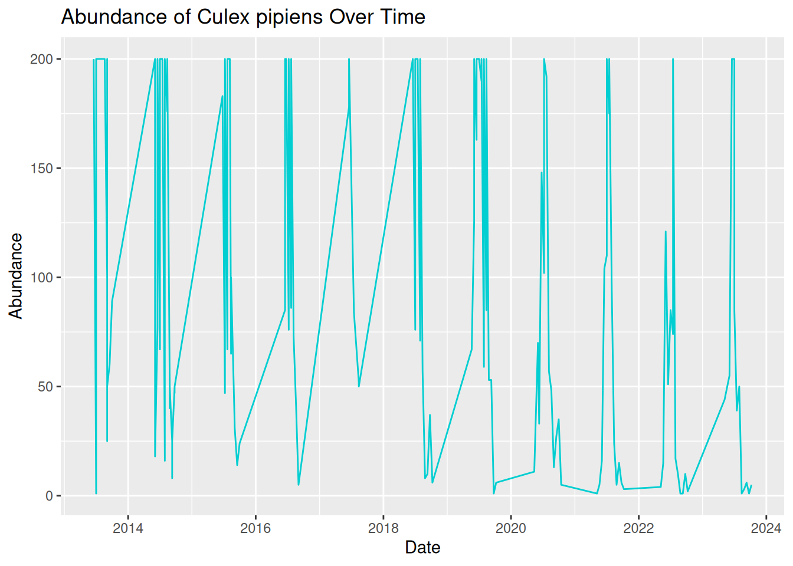


Oh dear, this graphic looks rather messy! Although we have used the correct code and ensured our date column is in the correct format, our visualisation is still difficult to read and interpret. This is because real-world VBD data often includes multiple samples collected on the same data. To create a more effective time-series visualisation, we need to summarise these samples into a single value per time point:


``` r
daily_abundance_goro <- mosquito_data_goro %>%
  group_by(sample_start_date) %>%
  summarise(total_abundance = sum(sample_value, na.rm = TRUE))
```


We can now use the summarised daily abundance data to try plotting again, this time using `daily_abundance_goro` as our data and `total_abundance` on our y-axis:


``` r
daily_abundance_plot_goro <- ggplot(daily_abundance_goro, aes(x = sample_start_date, y = total_abundance)) +
  geom_line(colour = "darkturquoise") +
  labs(
    title = "Abundance of Culex pipiens Over Time",
    x = "Date",
    y = "Abundance"
  )

daily_abundance_plot_goro
```

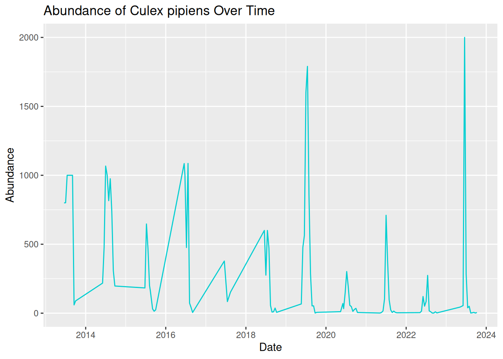


This is much better! Our visualisation effectively shows the trend of mosquito abundance over time at our selected location.


In this plot:

- The x-axis represents the continuous sampling time period.
- The y-axis represents mosquito abundance.
- The line connects daily abundance over continuous time.


Time-series abundance plots like this one can provide useful insights into seasonal dynamics within vector populations. These can be useful when identifying patterns in our data:

- Strong seasonality - abundance spikes in summer each year. 
- Year-to-year variability - some years have higher peaks than others.
- General trend - although abundance varies within the year, the peak each year seems to be increasing over time.


::: {.rmdtip}
**Tip:** Remember to save your graphic:


```r
ggsave("daily_abundance_all.pdf", plot = daily_abundance_plot_all)
```
:::


### Abundance Across Multiple Locations Over Time
In the previous examples, we have visualised abundance at multiple sampling locations, and abundance changes over time for a single location, but what if we combine these to look at abundance across multiple locations over time?


In VBD research, data are commonly collected from multiple sampling sites, and we often want to compare how vector abundance varies across these locations simultaneously.


We can achieve this by developing our time series plot to include multiple locations. Before, we grouped the data by the date alone, but this time, we want to group the data by both sampling location and date, so that abundance is calculated separately for each location over time:


``` r
daily_abundance_all_locations <- mosquito_data %>%
  group_by(sample_location, sample_start_date) %>%
  summarise(total_abundance = sum(sample_value, na.rm = TRUE),
    .groups = "keep")
```


::: {.rmdcaution}
**Frequent mistake:** Be sure to add `.groups = "keep"` when adding multiple variables to group_by. Without this, some packages in R will drop variables after the first `group_by` variable, and you will see a message like this:


`summarise() has grouped output by 'sample_location'. You can override using the .groups argument.`
:::


To visualise the data, we will generate a time-series abundance plot as we did before, but this time, we will use the `group = sample_location` argument within `aes()` to tell R that we want a separate line for each different sampling location:


``` r
daily_abundance_plot_all <- ggplot(
  daily_abundance_all_locations,
  aes(x = sample_start_date, y = total_abundance, group = sample_location)
) +
  geom_line(colour = "darkturquoise") +
  labs(
    title = "Abundance of Culex pipiens Across Locations Over Time",
    x = "Date",
    y = "Abundance"
  )

daily_abundance_plot_all
```


This is the visualisation we wanted, but it looks a bit messy. All the lines are displayed in the same colour, which makes the plot difficult to read. We can see patterns of abundance change over time, but it is difficult to distinguish between different locations. 


What we are seeing here is that **more complex visualisations are not always better visualisations**, especially if interpretation is limited. 


One option to improve our visualisation and to help distinguish between locations is to assign a different colour to each sampling location. To do this, we map `sampling_location` to the `colour` aesthetic within `aes()`, rather than assigning the line colour within `geom_line()`:


``` r
daily_abundance_plot_all <- ggplot(
  daily_abundance_all_locations,
  aes(x = sample_start_date, y = total_abundance, colour = sample_location)
) +
  geom_line() +
  labs(
    title = "Abundance of Culex pipiens Across Locations Over Time",
    x = "Date",
    y = "Abundance",
    colour = "Sampling Location"
  )

daily_abundance_plot_all
```

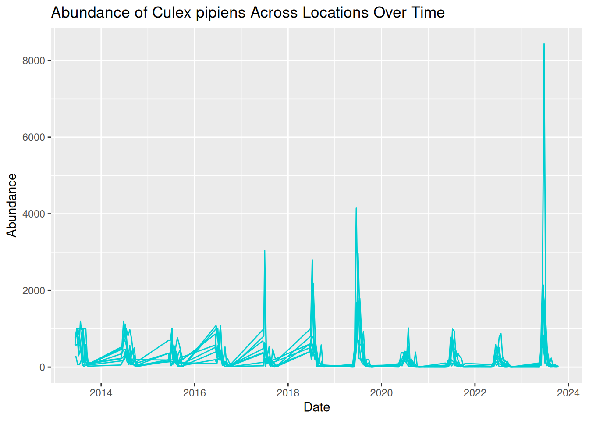


By adding colour, each line now represents a different sampling location more clearly, with a key detailing the line colour for each location. This makes it easier to identify patterns across locations. 


By plotting both location and time together, we can identify patterns in the data:

- Strong seasonal patterns across all locations, with patterns of sharp peaks and rapid declines each year.
- Although trends over time are similar across locations, some show higher abundance than others.
- Some extreme peaks in abundance stand out compared to the general trends. These may represent natural variation, such as optimal conditions and location for mosquito breeding, or these observations could be outliers. Further testing would be needed to assess this. 


::: {.rmdtip}
**Tip:** Remember to save your graphic:


```r
ggsave("daily_abundance_all.pdf", plot = daily_abundance_plot_all)
```
:::


However, while using colour can definitely improve graphics, visualisations can still feel overcrowded when too many groups are displayed together. For example, our visualisation plots 8 different locations on the same graph. Overlapping lines and similar temporal patterns can make it difficult to fully interpret the data. 


Additionally, using colour alone can cause difficulties with accessibility to all audiences, which we will address later in this session.


### Using Faceting to Improve Clarity
One useful solution to this overcrowding is faceting, a feature in `ggplot2` that splits a single plot into multiple smaller panels.


Each panel displays a subset of the data, allowing patterns to be compared side-by-side without overlapping elements. By separating the data into smaller panels, we can often reveal patterns that might otherwise be hidden within a crowded visualisation.


Faceting is particularly useful when:

- Comparing multiple species.
- Comparing sampling sites.
- Exploring patterns across environmental conditions. 


We can apply faceting to our previous time-series visualisation to separate each sampling location into its own panel, rather than using different colours. This directly addresses the overlapping lines,  improving the overall clarity and readability.


To do this, we add `facet_wrap()` to our existing code, which tells R that we want to generate several panels separated by location:


``` r
daily_abundance_plot_faceted <- ggplot(
  daily_abundance_all_locations,
  aes(x = sample_start_date, y = total_abundance)
) +
  geom_line(colour = "darkturquoise") +
  facet_wrap(~ sample_location) +
  labs(
    title = "Abundance of Culex pipiens Across Locations Over Time",
    x = "Date",
    y = "Abundance"
  )

daily_abundance_plot_faceted
```


By separating each sampling location into its own panel, the patterns in the data become much clearer:

- Seasonal trends are still evident across all locations, but we are now able to see how these patterns vary between locations more easily.
- Differences in abundance magnitude are much clearer, with some locations consistently showing higher peaks, and others reflecting relatively low abundance across the time-series. 
- Extreme peaks can be clearly associated with specific locations without overlapping lines hiding these observations.


Overall, faceting improves clarity by reducing visual clutter and allowing direct comparisons between locations. This makes it easier to interpret both independent trends per location and compare patterns across multiple locations.


::: {.rmdnote}
**Optional refinement:** In our current visualisation, all panels share the same y-axis scale, which is good for comparisons. However, this scale also means extreme peaks are visually dominant, and locations with smaller peaks look flat in comparison.


We can add `scales = "free_y"` within `facet_wrap()` to adjust the y-axis scales across the panels, allowing us to visualise the patterns per location in greater detail:


``` r
daily_abundance_plot_faceted_Y <- ggplot(
  daily_abundance_all_locations,
  aes(x = sample_start_date, y = total_abundance)
) +
  geom_line(colour = "darkturquoise") +
  facet_wrap(~ sample_location, scales = "free_y") +
  labs(
    title = "Abundance of Culex pipiens Across Locations Over Time",
    x = "Date",
    y = "Abundance"
  )

daily_abundance_plot_faceted_Y
```


:::


### Applying These Principles to Multiple Species and Datasets
Various vector species can exhibit very different ecological behaviours. For instance:

- Some species may emerge earlier in the season.
- Some may reach a higher peak abundance.
- Others may vary in abundance depending on particular habitats or hosts.


Understanding these differences is important when studying disease transmission dynamics. Luckily, you already have the tools to visualise these patterns!


In the last example, we visualised abundance over time, grouped by sampling location. For multiple species comparisons, we do the same abundance plots but grouped by species, rather than sampling location. 


This is an important advantage of using flexible tools such as R and `ggplot2`. Once we understand the principles of building effective visualisations, we can apply them to many different datasets and research questions. 


## Drawing Hypotheses from Complex Visualisations 
In the **Pre- Live Session content**, we looked at how simple visualisations can help us identify patterns in data and develop initial hypotheses.


Real-world VBD datasets are often complex, containing observations collected across multiple locations, species, and time periods. When visualised, these datasets can reveal more nuanced patterns, allowing researchers to develop more detailed and targeted hypotheses. 


Let’s have a go at building on the earlier examples and consider how complex visualisations can help us refine our scientific questions. Based on this visualisation, what hypotheses could you generate about mosquito abundance?


``` r
daily_abundance_plot_faceted_Y
```

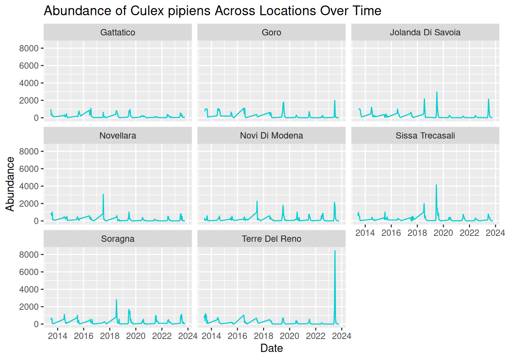


::: {.rmdtip}
**Tip:** Consider these prompts to formulate your hypotheses:

- Patterns over time
- Differences between locations
Unusual observations
- Alternative explanations for the same pattern
:::


While visualisations are extremely useful for identifying patterns, it is important to remember that they do not by themselves confirm causal relationships. Instead, they provide a starting point for developing hypotheses that can later be tested using statistical models, experimental studies, or additional data collection.


In practice, this process often involves several steps:

- Identifying patterns in the visualisation.
- Proposing possible explanations for those patterns.
- Considering alternative explanations.
- Designing analyses or studies that could test these hypotheses.


By working through this process, researchers can move from simple visual observations to well-defined scientific questions that contribute to a deeper understanding of vector ecology and disease transmission dynamics.


## What Makes a Good Visualisation? 
So far in this workshop, we have focused on how to create visualisations that explore patterns in vector surveillance data. However, as we have seen, not all visualisations communicate information clearly or effectively. 


A well-designed visualisation should help the viewer quickly understand the key message of the data. Poorly designed visualisations, on the other hand, can be confusing, misleading, or difficult to interpret. 


We will now explore the characteristics that contribute to effective data visualisations, based on your own experience and the visualisations you have previously seen. Consider what you think makes a good or bad visualisation. 


Some features commonly associated with good visualisations include:

- **Clarity** - the plot communicates its message quickly and clearly.
- **Accuracy** - the visual representation reflects the underlying data correctly.
- **Simplicity** - unnecessary elements that distract from the data are avoided. 
- **Accessibility** - the visualisation can be interpreted by a wide audience. 


For example, clear axis labels, readable text, and appropriate colours all contribute to making a visualisation easier to interpret. 


Conversely, poor visualisations may include limitations such as:

- Unclear or missing axis labels.
- Confusing colour schemes.
- Unnecessary visual elements.
- Misleading scales or distorted representation of data.


These issues can make it difficult for viewers to understand the patterns being communicated by the visualisation.


## Collaborative Task: Improving a Flawed Visualisation 
To explore these concepts in practice, we will now work collaboratively to improve a series of intentionally flawed visualisations.


We will split into breakout rooms, where each group will be given one visualisation that contains a different common visualisation mistake. These may include:

- Confusing colour schemes.
- Unclear axis labels. 
- Inappropriate chart types.
- Missing legends.
- Excessive visual clutter.


The goal of the activity is to identify the problems within the visualisation and work together to redesign it so that the underlying dataset and associated patterns are communicated more clearly. 


You will need to work together to:

- Identify what makes the visualisation difficult to interpret.
- Modify the code to create an improved version of the visualisation.
- Be prepared to briefly explain the changes your group made.


Note that there is no single “correct” solution. The goal of this task is to think critically about how visualisation design choices influence how data is interpreted.


::: {.rmdtip}
**Tip:** Consider questions such as:

- What is the main message of the visualisation?
- What aspects of the current design make the message difficult to interpret?
- How could the visualisation be improved?
:::


This activity contributes to experience in collaborative critique, a useful skill in research settings. Real-world visualisations are often refined through feedback from colleagues and collaborators. 


### Graph 1
Dataset: [group1_and_2_data.csv](https://github.com/One-Health-VBD-Hub/vbd-hub-training-workshops/blob/main/data/group1_and_2_data.csv)


Flawed code:


``` r
library("tidyverse")

group1_data <- read.csv("data/group1_and_2_data.csv")

group1_data$sample_start_date <- as.Date(group1_data$sample_start_date)

daily_abundance_all <- group1_data %>%
  group_by(sample_location, sample_start_date) %>%
  summarise(total_abundance = sum(sample_value, na.rm = TRUE),
            .groups = "keep")

group1_plot <- ggplot(daily_abundance_all,
       aes(x = sample_start_date, y = total_abundance, group = sample_location)) +
  geom_line(colour = "darkturquoise") +
  labs(
    title = "Mosquito Abundance Over Time",
    x = "Date",
    y = "Abundance"
  )

group1_plot
```

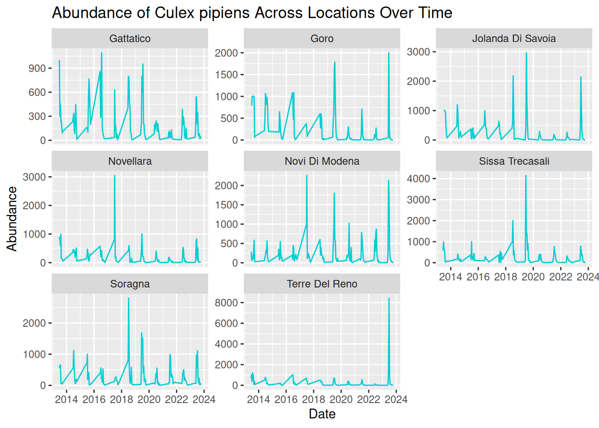


### Graph 2
Dataset: [group1_and_2_data.csv](https://github.com/One-Health-VBD-Hub/vbd-hub-training-workshops/blob/main/data/group1_and_2_data.csv)


Flawed code:


``` r
library("tidyverse")

group2_data <- read.csv("data/group1_and_2_data.csv")

group2_data_cadeo <- group2_data %>%
  filter(sample_location == "Cadeo")

group2_data_cadeo$sample_start_date <- as.Date(group2_data_cadeo$sample_start_date)

group2_plot <- ggplot(group2_data_cadeo,
       aes(x = sample_start_date, y = sample_value)) +
  geom_col(fill = "darkturquoise") +
  labs(
    title = "Mosquito Abundance Over Time",
    x = "Date",
    y = "Abundance"
  )

group2_plot
```


### Graph 3
Dataset: [group3_and_4_data.csv](https://github.com/One-Health-VBD-Hub/vbd-hub-training-workshops/blob/main/data/group3_and_4_data.csv)


Flawed code:


``` r
library("tidyverse")

group3_data <- read.csv("data/group3_and_4_data.csv")

group3_data$sample_start_date <- as.Date(group3_data$sample_start_date)

daily_abundance <- group3_data %>%
  group_by(sample_location, sample_start_date) %>%
  summarise(total_abundance = sum(sample_value, na.rm = TRUE),
            .groups = "keep")

group3_plot <- ggplot(daily_abundance,
       aes(x = sample_start_date, y = total_abundance, colour = sample_location)) +
  geom_line()

group3_plot
```

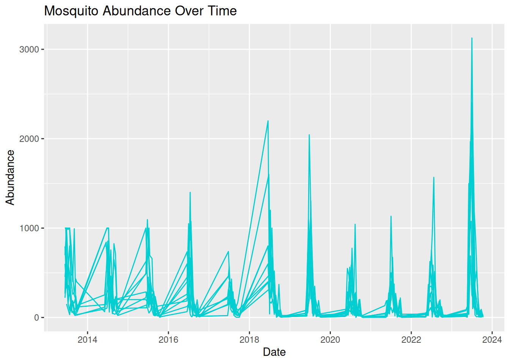


### Graph 4
Dataset: [group3_and_4_data.csv](https://github.com/One-Health-VBD-Hub/vbd-hub-training-workshops/blob/main/data/group3_and_4_data.csv)


Flawed code:


``` r
library("tidyverse")

group4_data <- read.csv("data/group3_and_4_data.csv")

group4_data$sample_start_date <- as.Date(group4_data$sample_start_date)

daily_abundance_all <- group4_data %>%
  group_by(sample_start_date) %>%
  summarise(total_abundance = sum(sample_value, na.rm = TRUE))

group4_plot <- ggplot(daily_abundance_all,
       aes(x = sample_start_date, y = total_abundance)) +
  geom_line(colour = "darkturquoise") +
  labs(
    title = "Mosquito Abundance Over Time",
    x = "Date",
    y = "Abundance",
    colour = "Sampling Location"
  )

group4_plot
#> Ignoring unknown labels:
#> • colour : "Sampling Location"
```

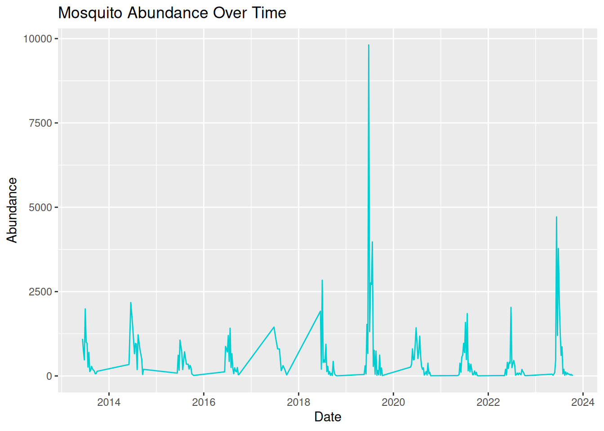


## Communicating to Different Audiences 
We can use visualisations to communicate patterns in our data to a variety of audiences. However, our visualisation and the language we use to discuss it need to be appropriately adjusted.


When designing a visualisation, it is therefore important to consider who the intended audience is and what information they need to best understand your data and findings. 


Your audience may include academic researchers, policymakers, or members of the public, all of which may have different levels of technical understanding and communication needs. 


Academic audiences are often more comfortable interpreting complex figures and statistics, and may expect details on variation and uncertainty in the data. 


Policymakers typically prefer visualisations that clearly communicate relevant trends used to influence decision-making.


For public engagement activities, visualisations usually need to be more accessible and use simple language so the audience can understand what the graphic is communicating, without specialised knowledge. 


Adapting visualisations to suit different audiences is an important skill for researchers who wish to communicate their findings effectively. 


::: {.rmdtip}
**Tip:** When designing visualisations for specific audiences, try to consider:

- The level of technical knowledge.
- How clearly the key findings are communicated.
- Any additional information needed to easily interpret the visualisation.
:::


## Visualisation Themes & Accessible Graphics 

### Themes
So far, we have focused on choosing appropriate plot types, developing visualisations with multiple data types, and using visualisations to identify patterns in your data. Effective visualisations should also consider how the visual design contributes to the interpretability and accessibility of a plot to various audiences.


In `ggplot2`, the visualisation design can be controlled using themes. Themes allow us to adjust non-data elements of a plot, including:

- Background colour
- Grid lines
- Text size and font
- Legend position


All of these help to improve the clarity and readability of a visualisation.


Themes can be applied to any ggplot using the `theme()` function or by using one of the existing `ggplot2` theme presets. For example, we can apply `theme_minimal()`, a simple theme from `ggplot2`, to one of our existing plots:


``` r
daily_abundance_plot_goro <- ggplot(daily_abundance_goro, aes(x = sample_start_date, y = total_abundance)) +
  geom_line() +
theme_minimal() +
  labs(
    title = "Abundance of Culex pipiens Over Time",
    x = "Date",
    y = "Abundance"
  )

daily_abundance_plot_goro
```

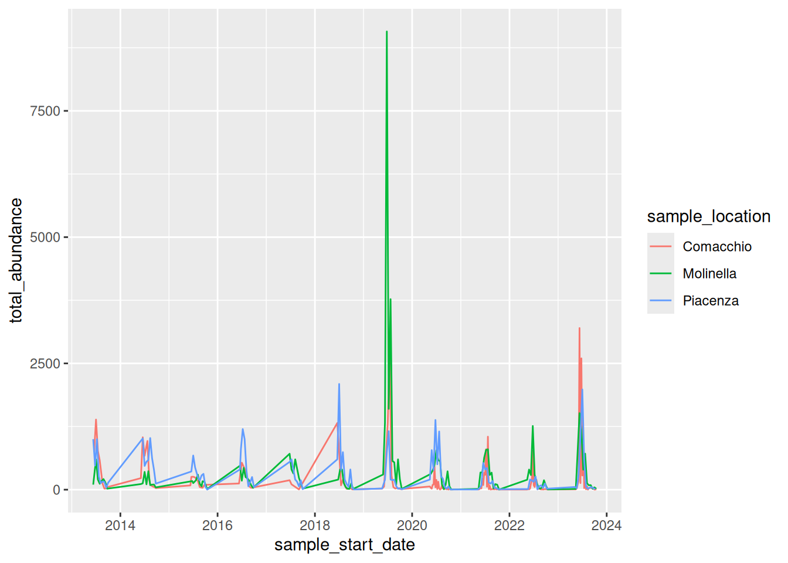


We can see that applying this theme removes the background shading and uses simple black and grey colours, resulting in a clean and easily readable visualisation. 


`ggplot2` has several themes you can use - some commonly used themes include:

- `theme_minimal()`
- `theme_bw()`
- `theme_classic()`


Using consistent themes across visualisations can help to create a more professional and cohesive appearance. This is particularly useful when using visualisations to communicate data to various audiences, such as conference talks or publications. 


### Improving Visual Clarity
When we visualise our data, we want key patterns to stand out, particularly when presenting our data to others. We can achieve this by improving the **contrast**, for example, increasing the line width in a time series plot:


``` r
geom_line(linewidth = 1.2)
```


Or changing point style in a scatter plot:


``` r
geom_point(shape = 17)
```


Another simple method for improving visual clarity that people often forget is clear **labels** and **titles**. We have already learnt how to add these when using `ggplot2`:


``` r
labs(
    title = "Abundance of Culex pipiens Over Time",
    x = "Date",
    y = "Abundance"
  )
```


Remember, visualisation labels should be clear and informative - make sure the title and axis are readable, and the audience understands what they are looking at. Consider the medium in which you want to share your visualisation - all text should be large enough to read on presentation slides, when printed, or when viewed on different screen sizes.


Earlier in this session, we saw how visualisation can quickly become overcrowded and difficult to interpret. Try to **avoid visual clutter** by:

- Reducing the number of variables displayed in one graphic
- Avoiding unnecessary layers.
- Using methods such as faceting to split plots into separate panels.


Using colours in your visualisations can be helpful, for example, to highlight different groups. However, colour can quickly reduce the clarity of your visualisation, particularly if you use bright or clashing colours with minimal contrast. 


::: {.rmdtip}
**Tip:** For best readability, remember to use dark lines or points on a light background. Try to use accessible colour palettes so that your visualisation is accessible to a wider audience.
:::


### Designing Accessible Visualisations
Accessibility is an important consideration when designing visualisations, particularly when communicating your data to diverse audiences. For instance, some viewers may have visual impairments, such as colour vision deficiencies, which can make certain visualisations difficult to interpret. 


There are multiple principles which can help improve the accessibility of your visualisations. Some commonly used strategies to consider include:


**1. Using accessible colour palettes** - some colour combinations can be difficult to differentiate, such as red and green. `ggplot2` includes `viridis` colour scales, which are designed to improve visual clarity and accessibility of visualisations: `scale_colour_viridis_d()`


**2. Using multiple visual cues** - using alternative visual cues ensures that all elements in your visualisations remain clear and visible without colour. Alternative options include line types, point shapes, and faceting. 


**3. Exporting visualisations** - you may have noticed that throughout this workshop, we have saved our visualisations as pdf files. This format improves accessibility by allowing viewers to view details more clearly by zooming in without reducing image quality.


**4. Providing alternative text (alt-text)** - when sharing visualisations in digital formats, alternative text descriptions can be added so that screen reader users can access your visualisations. 


Designing accessible visualisations improves inclusivity and results in **clearer and more effective communication for all viewers**.


## Preparing for the Challenge Task 
The final session of this training will provide an opportunity for you to independently apply the skills and concepts discussed throughout the **Pre-** and **Live Session** content, including:

- Selecting appropriate plot types.
- Clearly communicating patterns in the data.
- Considering the needs of different audiences.
- Applying effective visual design principles.


The **Challenge Task** will have multiple levels and is designed to encourage applied thinking. We encourage you to experiment with different approaches and discuss potential difficulties with each other.


We encourage you to have a go at the task on your own, but a walkthrough version will be released after a few hours, should you need additional guidance.


## Conclusion
Throughout this workshop, we have explored how visualisations can be used to better understand and communicate VBD data. 


We began by building simple abundance plots and then extended them to explore patterns across time, space, and species. We also discussed how visualisations can support hypothesis generation and how thoughtful design choices can improve the clarity and accessibility of scientific figures. 

Effective visualisation is a valuable skill for researchers working with complex datasets. By carefully considering how data are represented, we can make patterns more visible, communicate findings more effectively, and support evidence-based decision-making in VBD research. 


# Challenge Task 


## Introduction
This **Challenge Task** provides an opportunity for you to independently apply the skills and concepts discussed throughout this online training, including:

- Selecting appropriate plot types.
- Clearly communicating patterns in the data.
- Considering the needs of different audiences.
- Applying effective visual design principles.


The **Challenge Task** has multiple levels and is designed to encourage applied thinking. Feel free to work through the levels that apply to you, but we encourage you to try all levels to make the most of the training. 


During the **Challenge Task**, we encourage you to experiment with different approaches and discuss potential difficulties with each other via the [VBD Hub Forum](https://forum.vbdhub.org/). Our demonstrators and I will be monitoring the Forum if you need any additional support. 

After approximately 2 hours, a workbook version of this challenge will be made available. This is not an answer sheet, and we encourage you to continue coding yourself, rather than reading through the solutions. This workbook will walk you through the tasks like in the examples used throughout the training, but with a bit more independence before providing the answers.


## Level 1
Open [challenge_data.csv](https://github.com/One-Health-VBD-Hub/vbd-hub-training-workshops/blob/main/data/challenge_data.csv) in RStudio.


Identify data types from the provided dataset. 


Visualise abundance across the different species.


## Level 2
Visualise abundance across the different species over time.


Identify any patterns in your data.


## Level 3
Formulate some hypotheses from your data.


## Level 4
Identify any visual or accessibility limitations across your visualisations and make appropiate edits.


## Level 5
Consider how you would present your graphs as if you were presenting to:

- i) Academics
- ii) Policy makers
- iii) Public engagement


You may choose to write a draft script, present out loud to a colleague, or discuss with a fellow participant in the VBD Hub Forum.


## Example Solutions
As we have discussed, there are often several approaches to visualising data, and therefore no single correct answer. Below are some example solutions to the Challenge Task, but the main aim of this section is to encourage applied thinking so you can further develop the skills from with training to use in your own research.


### Level 1
When we look at `challenge_data`, we can see that we are looking at various vector species at Salt Lake over a number of years. 


``` r
library("tidyverse")

challenge_data <- read_csv("data/challenge_data.csv")
#> Rows: 27285 Columns: 15
#> ── Column specification ────────────────────────────────────
#> Delimiter: ","
#> chr  (8): genus, species, sample_unit, sample_sex, sampl...
#> dbl  (3): sample_value, sample_lat_dd, sample_long_dd
#> lgl  (2): value_transform, study_design
#> date (2): sample_start_date, sample_end_date
#> 
#> ℹ Use `spec()` to retrieve the full column specification for this data.
#> ℹ Specify the column types or set `show_col_types = FALSE` to quiet this message.
challenge_data
#> # A tibble: 27,285 × 15
#>    genus species           sample_start_date sample_end_date
#>    <chr> <chr>             <date>            <date>         
#>  1 Aedes vexans sensu lato 2015-09-29        2015-09-29     
#>  2 Aedes vexans sensu lato 2015-09-29        2015-09-29     
#>  3 Aedes vexans sensu lato 2015-09-29        2015-09-29     
#>  4 Aedes vexans sensu lato 2015-09-29        2015-09-29     
#>  5 Aedes vexans sensu lato 2015-09-29        2015-09-29     
#>  6 Aedes vexans sensu lato 2015-09-29        2015-09-29     
#>  7 Aedes vexans sensu lato 2015-09-29        2015-09-29     
#>  8 Aedes vexans sensu lato 2015-09-29        2015-09-29     
#>  9 Aedes vexans sensu lato 2015-09-29        2015-09-29     
#> 10 Aedes vexans sensu lato 2015-09-29        2015-09-29     
#> # ℹ 27,275 more rows
#> # ℹ 11 more variables: sample_value <dbl>,
#> #   sample_unit <chr>, value_transform <lgl>,
#> #   sample_sex <chr>, sample_stage <chr>,
#> #   sample_lat_dd <dbl>, sample_long_dd <dbl>,
#> #   species_id_method <chr>, study_design <lgl>,
#> #   sampling_method <chr>, location_description <chr>
```


To begin visualising the data, we want to plot the abundance of each species. In the previous examples, we were grouping by sampling location, and we use very similar approaches when looking at multiple species. We can apply `group_by()` and `summarise()` like we did in the earlier example:


``` r
abundance_per_species <- challenge_data %>%
  group_by(species) %>%
  summarise(
    mean_abundance = mean(sample_value, na.rm = TRUE),
    se_abundance = sd(sample_value, na.rm = TRUE) / sqrt(sum(!is.na(sample_value)))
  )
```


We can start with an abundance bar plot with whiskers to assess variation in abundance across the different species, using our summarised data:


``` r
abundance_plot_species <- ggplot(abundance_per_species,
                                 aes(x = species, y = mean_abundance)) +
  geom_col(fill = "darkturquoise") +
  geom_errorbar(aes(
    ymin = mean_abundance - se_abundance,
    ymax = mean_abundance + se_abundance
  ),
  width = 0.2) +
  labs(
    title = "Mean Abundance of Different Vector Species in Salt Lake",
    x = "Species",
    y = "Mean Abundance"
  )

abundance_plot_species
```

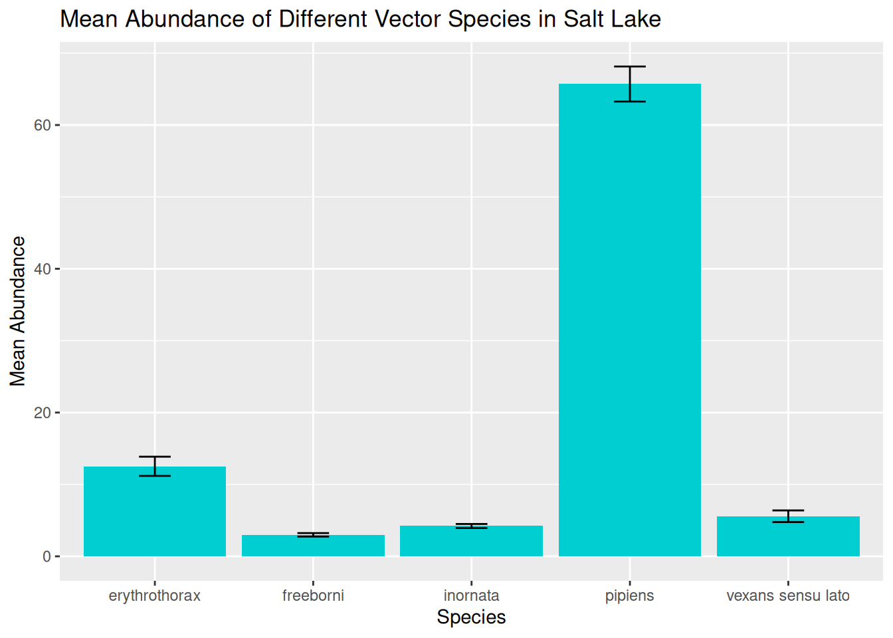


In this visualisation, we can see the spread of data across the different species and begin to identify preliminary trends. 


However, as we have discussed, these visualisations will hide some of the variation in the data, particularly in terms of variation in abundance over time. 


### Level 2
We next want to plot the abundance of different vector species over time. Remember, before we can visualise a time series, we want to group the data by the date, and in this case the species as well:


``` r
daily_abundance_all_species <- challenge_data %>%
  group_by(species, sample_start_date) %>%
  summarise(total_abundance = sum(sample_value, na.rm = TRUE),
            .groups = "keep")
```


With the data grouped and summarised appropriately, we are ready to visualise abundance of different species over time. We have covered several approaches to this, and we will start with plotting one line for each species, and use line colour to differentiate between species:


``` r
daily_abundance_plot_species <- ggplot(
  daily_abundance_all_species,
  aes(x = sample_start_date, y = total_abundance, colour = species)
) +
  geom_line() +
  labs(
    title = "Mean Abundance of Different Vector Species in Salt Lake",
    x = "Date",
    y = "Abundance",
    colour = "Species"
  )

daily_abundance_plot_species
```

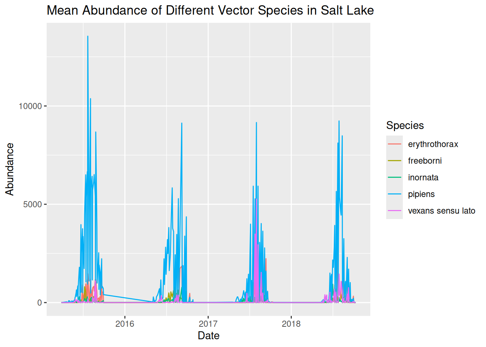


When plotting multiple groups, in this case species, we have shown that visualisations can quickly become overcrowded, making them difficult to interpret. Although we have used line colour to differentiate between species, it is still tricky to see the trends in our data. 


We can use faceting to separate our visualisation into separate panels for each species:


``` r
daily_abundance_plot_species_faceted <- ggplot(
  daily_abundance_all_species,
  aes(x = sample_start_date, y = total_abundance)
) +
  geom_line(colour = "darkturquoise") +
  facet_wrap(~ species) +
  labs(
    title = "Mean Abundance of Different Vector Species in Salt Lake",
    x = "Date",
    y = "Abundance"
  )

daily_abundance_plot_species_faceted
```

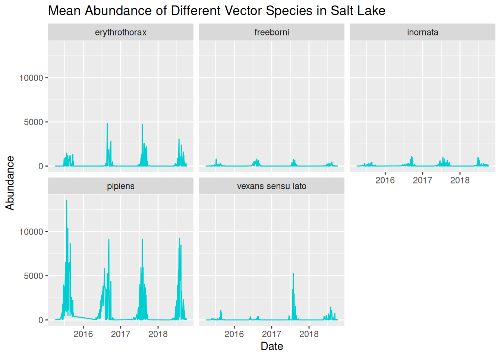


We can now see the trends in abundance of each species much more clearly, but we can further refine this again by adjusting the y-axis scales for each panel:


``` r
daily_abundance_plot_species_faceted_y <- ggplot(
  daily_abundance_all_species,
  aes(x = sample_start_date, y = total_abundance)
) +
  geom_line(colour = "darkturquoise") +
  facet_wrap(~ species, scales = "free_y") +
  labs(
    title = "Mean Abundance of Different Vector Species in Salt Lake",
    x = "Date",
    y = "Abundance"
  )

daily_abundance_plot_species_faceted_y
```

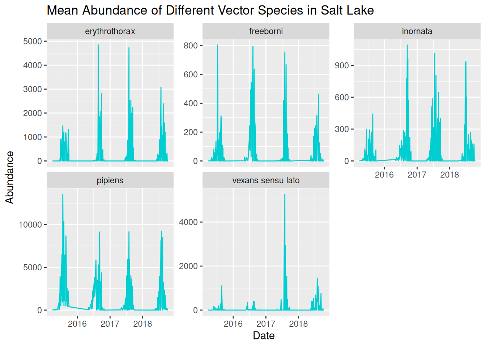


Now that we have a clear and readable visualisation, we can start to identify patterns in our dataset. 


### Level 3
Identifying patterns in our dataset allows us to formulate data-driven hypotheses. Reflect on the earlier prompts to consider potential hypotheses for this dataset:

- Patterns over time
- Differences between locations
- Unusual observations
- Alternative explanations for the same pattern


Remember, a hypothesis is a **testable explanation** for an **observed pattern**. We are not just asking questions about the patterns in our data, but how ecological context might be applied. For instance, if abundance peaks in the summer, we would want to consider warmer temperatures or increased humidity, and how this is relevant to VBD contexts, such as larval development.


### Level 4
When designing visualisations, we want to make them visually appealing to improve interpretability and accessibility.


Common considerations for improving visual clarity including:

- Applying themes.
- Increasing font size.
- Avoid overcluttering.
- Use colour for emphasis and contrast.
- Ensure titles and labels are clear and informative.
- Apply accessible elements, such as accessible colour palettes, alternative visual cues, exporting as pdf, and alt-text.


Have you considered these in your Challenge Task visualisations?


### Level 5
Whether you have chosen to present to academics, policymakers, or members of the public, it is useful to remember these prompts:

- The level of technical knowledge.
- How clearly the key findings are communicated.
- Any additional information needed to easily interpret the visualisation.


These principles apply whether you are designing a visualisation for a presentation, journal article, or poster.


# Reading & Resources

- [Data Visualisation with ggplot2 Cheatsheet](https://rstudio.github.io/cheatsheets/data-visualization.pdf)
- [Ten Simple Rules for Better Figures](https://journals.plos.org/ploscompbiol/article?id=10.1371/journal.pcbi.1003833)
- [Accessibility](https://cran.r-project.org/web/packages/afcharts/vignettes/accessibility.html)
- [tick_dataset_raw.csv](https://github.com/One-Health-VBD-Hub/vbd-hub-training-workshops/blob/main/data/tick_dataset_wrangled.csv)
- [mosquito_dataset_raw.csv](https://github.com/One-Health-VBD-Hub/vbd-hub-training-workshops/blob/main/data/mosquito_dataset_raw.csv)
- [challenge_data_raw.csv](https://github.com/One-Health-VBD-Hub/vbd-hub-training-workshops/blob/main/data/challenge_data_raw.csv)


