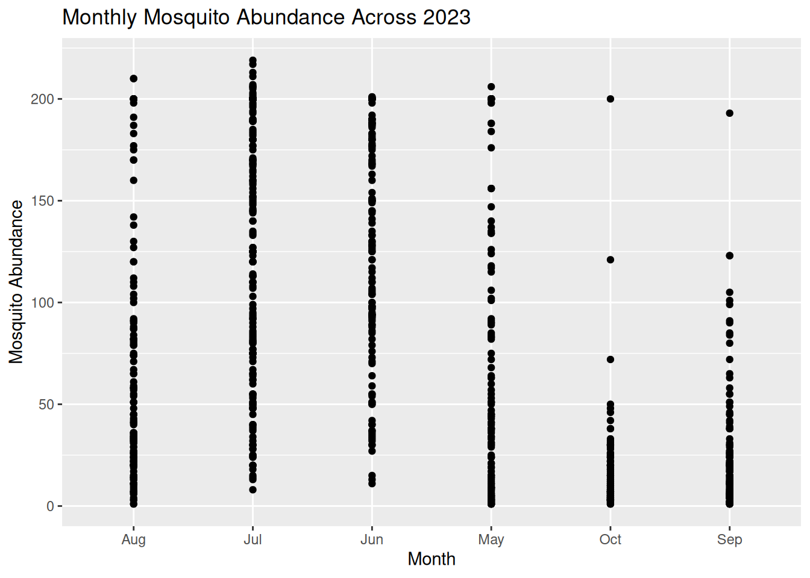
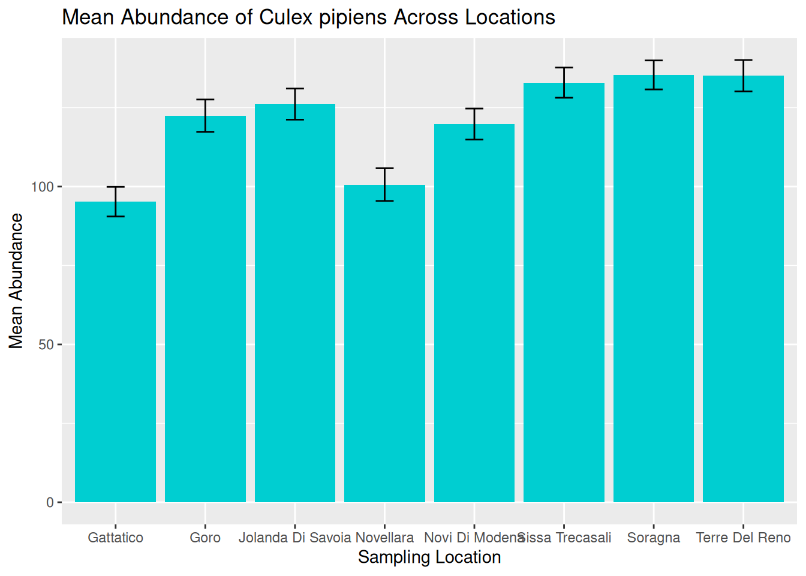

# (PART) Workshop 1: Data Visualisations in R {-}

# Introduction


## Learning objectives

**By the end of this workshop, you should be able to:**

1. Generate accessible visualisations to communicate complex data to different audiences and stakeholders.
2. Formulate data-driven hypotheses from effective data visualisations.
3. Build collaborative, professional connections within the VBD community.


## Prerequisites

**Before participating in this workshop, you should have:**

- Foundational knowledge of programming in R and RStudio, including running code, installing packages, and working within scripts.
- Some experience of formatting datasets in R, such as importing .csv files and viewing dataframes.
- Basic understanding of VBD biology, including common vectors and pathogen transmission.


## Training Plan

### Pre- live session content
This is to be completed ahead of the **Live Session**.
Content will be available on the Hub under [Learning Resources](https://vbdhub.org/resources/learn).


The [VBD Hub Forum](https://forum.vbdhub.org/t/online-training-data-visualisations-in-r/159) is available for support and networking.


### Live session
10:00 - 13:00 on Thursday 19th March, via Teams.


Content will be made available on the Hub under [Learning Resources](https://vbdhub.org/resources/learn) on the day of the **Live Session**.


### Challenge Task
Multi-stage task to be completed independently after the **Live Session**. The stages will increase in difficulty and provide an opportunity to apply what you have learnt to real VBD datasets.


Content will be posted on the VBD Hub under [Learning Resources](https://vbdhub.org/resources/learn) on the day of the Live Session.
The [VBD Hub Forum](https://forum.vbdhub.org/t/challenge-task-q-a-data-visualisations-in-r/160) will be available for support.


## Navigating Course Content
Many of the tasks in this workshop will be in a workbook-style format and will walk you through how to code specific functions and models. We encourage you to type this code yourself to practice syntax and gain the most out of the content provided, rather than copying and pasting.


All the datasets in this workshop have been tidied and wrangled for you. This is so we can focus on the key themes within this session - effective visualisations and graphics. Raw data is also provided, and we recommend you take a look at the “before” and “after” to better understand the data we are working with. 


All coding through this workshop will be done in Rstudio, a user friendly IDE (integrated development environment) for R language. Please ensure you have R and RStudio installed and updated ahead of the **Live Session**. If you do not already have R or RStudio installed, see [here](https://posit.co/download/rstudio-desktop/).


## Available Materials & Support
If you need a quick reminder of basic coding in R, additional materials and cheat sheets can be found here:

- [Biological Computing in R](https://vbdhub.org/MQB/notebooks/r.html)
- [Data Management (read up to Data visualization)](https://vbdhub.org/resources/learn/training-2025/data-management-and-visualisation)
- [Basic Hypothesis Testing](https://vbdhub.org/MQB/notebooks/t-f-tests.html)
-	[RStudio IDE Cheatsheet](https://rstudio.github.io/cheatsheets/rstudio-ide.pdf)
-	[Data Wrangling with dplyr Cheatsheet](https://rstudio.github.io/cheatsheets/data-transformation.pdf) 


If you need additional support through this workshop:

- The [**Forum**](http://forum.vbdhub.org) is a good place to discuss queries with fellow participants.
- Demonstrators will be available to help during the **Live Session**.
- During the **Challenge Task**, a specific discussion on the Forum will be open to ask demonstrators questions. One-to-one video support will also be available if required.
- For technical support (e.g. trouble accessing content or joining the Teams link), please contact support@vbdhub.org. This is **not** for coding or statistical support.


## Installing Packages
This workshop will use several R packages throughout, please install these ahead of the **Live Session**.


**Packages for this workshop:**

- `ggplot2`
- `tidyverse`
- `lubridate`


::: {.rmdtip}
**Reminder:** To install packages in R, use the `install.packages()` command.


To install one package:
``` r
install.packages("ggplot2")
```

To install multiple packages:
``` r
install.packages(c("ggplot2", "dplyr", "tidyr"))
```
:::


# Pre- Live Session Content


[link to optional recap of linear models and basic plots](#recap)


## Commonly Used Visualisations for VBD Data
Different types of data need different types of visualisations.


Choosing the appropriate plot to best represent your data is important to communicate your data and the proposed patterns clearly and accurately. 


In VBD research, common visualisations you might come across include:

- **Scatter plots** - useful to explore relationships between variables.
- **Boxplots** - useful to compare distributions between groups.
- **Line plots** - useful to visualise trends over time.
- **Bar plots** - useful to compare values between groups.
- **Maps** - useful to show spatial patterns.


In vector surveillance research, one of the most useful and frequently used visualisations is abundance plots. These can be used to show how vector counts change over time or across locations.


Abundance plots typically use lines to communicate overall trends in vector populations. However, points can also be used to show individual observations within the dataset. This can be particularly useful during exploratory analysis as it allows us to visualise variation in the data and identify outliers.


Throughout this training, we will focus on developing effective abundance plots with real VBD datasets. We will start with simple exploratory abundance plots in this **Pre- Live Session** content, and build more complex abundance plots during the **Live Session**.


## What can Visualisations Tell Us About Data?
Effective visualisations can help us to communicate complex datasets by quickly identifying distributions and patterns in the data that can be unclear from dataframes alone. 


Visualising data can help us to identify:

- **Distribution of data** - how values are spread across a dataset, including the spatial distribution of vectors or pathogens. 
- **Correlative relationships** - potential associations between multiple variables, such as vector populations and environmental factors.
- **Temporal trends** - variable changes over time, for example, vector abundance over time.
- **Inter-group comparisons** - differences between groups, for instance, vector species across regions.
- **Outliers or anomalies** - unexpected observations that may suggest errors to be addressed before modelling.


Given how much information we can extract from them, visualisations are often the first step in exploratory data analysis before further statistical modelling.


### Task 1: Visualising Tick Abundance Across Locations 
Let’s try visualising some VBD data. First, download [tick_dataset_wrangled.csv](https://github.com/One-Health-VBD-Hub/vbd-hub-training-workshops/blob/main/data/tick_dataset_wrangled.csv) and open it in RStudio:


``` r
tick_data <- read.csv("tick_dataset_wrangled.csv")
tick_data
```


This dataset contains tick abundance, `sample_value`, across two sampling locations, `sample_location`.


::: {.rmdcaution}
**Where most people make mistakes:** Remember to save tick_dataset_wrangled.csv to an appropriate **working directory** and **set your working directory** correctly in RStudio!
:::


We can plot this data to visualise the difference in abundance across the two sample locations. You might typically see bar plots used to visualise abundance across two groups, but here we will use a scatter plot to show individual observations, which allows us to assess variation and identify potential outliers in the dataset.


To do this, we will use the `ggplot2` package. `ggplot2` is one of the most commonly used packages for visualisations and graphics, so it is useful for you to understand how to code with this package. It is particularly good to build plots step-by-step by defining:

- The dataset we want to use.
- The variables we want to visualise.
- The type of plot we want to generate.


Run this code to generate a simple abundance plot of `tick_data` using points to show individual observations:


``` r
library("ggplot2")

tick_abundance_location <- ggplot(tick_data, aes(x = sample_location, y = sample_value)) +
geom_point() +
labs(
x = "Sampling Location",
y = "Tick Abundance",
title = "Tick Abundance Across Sampling Locations"
)

tick_abundance_location

```


You should now see a simple abundance plot in the “Plot” window of RStudio, which looks like this:


``` r
tick_abundance_location
```


::: {.rmdtip}
**Tip:** Using ggplot2 to code visualisations can look heavy, but what we are doing is breaking down each step of the plot like building blocks. Let’s have a closer look:


`ggplot(tick_data, aes(x = sample_location, y = sample_value))`
`tick_data` is the dataset we want to visualise.
`aes()` represents aesthetics, including which variables from the dataset we want to visualise. For this plot:
`x = sample_location` tells R to place sampling location on the x-axis.
`y = sample_value` tells R to place tick abundance on the y-axis.


`geom_point()`
Tells R to plot a point for each observation in the dataset. For this data, one observation is the tick count per sample collected at a particular location. We would change this if we wanted to use a line plot.


``` r
labs(
x = "Sampling Location",
y = "Tick Abundance",
title = "Tick Abundance Across Sampling Locations"
)
```
The `labs()` function simply adds labels to the visualisation to make it easier to interpret. For this plot, we have added an x-axis label, a y-axis label, and a title for the plot.
:::


It is a good idea to save your visualisations so you can easily refer back to them when you need. There are several ways to save visualisations in R, but it is good practice to use code:


`ggsave("tick_abundance_location.png", plot = tick_abundance_location)`


Now that we have visualised the data, we identify patterns and extract information about the dataset. 


From the visualisation, we can see:

- Tick abundance appears to be greater in Sogn and Fjordane than in Akershus and Østfold.
- Most observations across both locations show relatively low tick abundance, with a small number of samples showing much higher values. 
- Sogn and Fjordane has more samples than Akershus and Østfold, suggesting a potential bias in sampling effort. This is something which may need to be addressed when running further analysis. 
- Although some Sogn and Fjordane samples include very high tick counts, these values are spread across several observations, suggesting genuine variation in the data rather than single outliers.


### Task 2: Visualising Mosquito Abundance Over Time 
Let’s try another visualisation, this time plotting vector abundance over time. Visualising data across time can help us identify temporal trends, seasonal patterns, and periods of unusually high or low abundance.


Download the [mosquito_monthly_2023_subset.csv](https://github.com/One-Health-VBD-Hub/vbd-hub-training-workshops/blob/main/data/mosquito_monthly_2023_subset.csv) dataset and open in RStudio:


``` r
mosquito_monthly_data <- read.csv("mosquito_monthly_2023_subset.csv")
mosquito_monthly_data
```


Now, let’s visualise the data using another simple abundance plot using points to show individual observations:


``` r
mosquito_abundance_monthly <- ggplot(mosquito_monthly_data, aes(x = month, y = sample_value)) +
geom_point() +
labs(
x = "Month",
y = "Mosquito Abundance",
title = "Monthly Mosquito Abundance Across 2023"
)

mosquito_abundance_monthly
```


You should now see a new simple abundance plot in the “Plot” window of RStudio, which looks like this:


``` r
mosquito_abundance_monthly
```




Don’t forget to save your plot:


`ggsave("mosquito_abundance_monthly.png", plot = mosquito_abundance_monthly)`


Now it’s your turn to have a go at identifying patterns and information about the dataset from this new visualisation, as we did in **Task 1**. Please record your answers in the **Response Form** at the end of the **Pre- Live Session** content.


::: {.rmdtip}
**Tip:** Consider these prompts if you need some additional guidance:

- Can you observe any potential temporal or seasonal trends?
- How is the data distributed? Are abundance counts spread or clustered?
- Can you make comparisons between the different months?
- Are there any potential anomalies in the dataset?

:::


## Formulating Hypotheses From Visualisations
Now that we know what patterns can be drawn from data visualisations, we can begin to develop hypotheses on the mechanisms and processes that might explain these patterns. 


A hypothesis is a **testable explanation** for an **observed pattern**.


For example, if we visualised a dataset on *Culicoides* abundance over time and observed a pattern showing higher *Culicoides* counts during the summer months, we might suggest the following hypothesis: 
**“Higher temperatures during summer provide optimal conditions for Culicoides larval development, leading to increased abundance during this season.”**


Similarly, if we plotted a dataset on sandfly abundance across different habitat types and observed a pattern indicating higher sandfly counts in peri-domestic habitats, we might suggest this hypothesis: 
**“Peri-domestic environments increase sandfly abundance by providing suitable breeding habitats, such as organic waste from cattle sheds.”**


From these examples, we can understand how visualisations can help to generate data-driven research questions and hypotheses.


::: {.rmdimportant}
**Important:** Remember, data visualisations alone do not show causation. They can be used as a tool to highlight potential patterns that should be tested using further statistical analysis. 
:::


### Task 3: Formulating Hypotheses from Data Visualisations
Have another look at the visualisations you generated in **Tasks 1** and **2**, and consider the patterns we observed in the data.


What biological, environmental, or other factors might explain these patterns?


Write one possible hypothesis for each visualisation that could be tested using further analysis (you do **not** need to run further analysis for this workshop).


Please record your answers in the **Response Form** at the end of the **Pre- Live Session** content.


## Response Form 
Please complete this [Response Form](https://docs.google.com/forms/d/e/1FAIpQLScGu77Qc6dqKAdB7BsbdSOn-h407HI9_f7OWELcVfZLysxrJA/viewform?usp=publish-editor) after finishing the tasks above.


This form is anonymous and is **not** an assessment. Your responses will help us to understand which areas may require more support during the **Live Session**. We aim to tailor the content to the group's needs, so you gain the most from this workshop.


## Conclusion & Preparation for Live Session
Ahead of the live session, ensure you keep R and RStudio installed on your device, as well as the packages we prepared earlier. 


Please make sure you have Teams set up on your device and that your microphone is working. We will aim to send the link 48 hours before the live session. Please be aware that the live session will be recorded. 


# Live Session


## Live Session Schedule 

 - Introduction
 - Recap pre- Live Session
 - Build on Abundance Plots
 - Drawing Hypotheses from Complex Plots
 - BREAK
 - What Makes a Good Visualisation?
 - Collaborative task
 - Share Collaborative Task Results
 - BREAK
 - Communicating to Different Audiences
 - Visualisation Themes & Accessible Graphics
 - Prepare for Challenge Task & Conclusion


## Introduction 
Welcome to the **One Health Vector-Borne Diseases Hub Online Training**. My name is Chloё, and I work with the VBD Hub to develop training and workshops, like this session today. We are also joined by our lovely demonstrators, who will be available throughout the session to provide support and answer any questions you have. 


**VBD Hub** is a non-profit, open-source project funded by UKRI and Defra, which aims to improve accessibility and information sharing. To do this, the project builds infrastructure and tools to allow researchers to combine knowledge and share data within the VBD research community and with policymakers. 


Our focus today is **Visualisations in R**. By the end of this training, you should be able to: 

- Generate accessible visualisations to communicate complex data to different audiences and stakeholders.
- Formulate data-driven hypotheses from effective data visualisations.
- Build collaborative, professional connections within the VBD community.


In the **Pre- Live Session** content, you will have seen links to recap materials and cheat sheets. Feel free to use these if you need any reminders. If you need additional support, the **Forum** is a good first point of call where you can discuss queries with fellow participants. Our **demonstrators** will keep an eye on the chat during this call and can provide more support during tasks. 


The written version of this content is now available on the **VBD Hub website** if you wish to follow along with this format. These written materials will be available for you to access in future, including the code examples. You are welcome to follow along with the walkthrough code in this **Live Session**, but there is no pressure, and you can have a go at the code yourself later. 


If you have any technical difficulties or lose connection, try joining the meeting again when you can. If you need technical support, please contact support@vbdhub.org (**note**: this is only for technical support, not statistical support or questions on the course content). 


We have breaks scheduled into this session, but if you need to step away for a few minutes at all, feel free to do so quietly. 


## Recap Pre- Live Session Content 
In the **Pre- Live Session** content, we covered:

- Commonly used visualisations in VBD research, notably abundance plots.
- What visualisations can tell us about data, and how this can support exploratory analysis.
- How to use observed patterns from simple visualisations to formulate data-driven hypotheses.


During the tasks, we tried identifying patterns and details out the datasets and proposing hypotheses from our visualisations:

- 1. What patterns and data details can you identify from the **Monthly Mosquito Abundance across 2023** plot?
- 2. What hypothesis do you propose for the visualisation in **Task 1: Tick Abundance Across Sampling Locations**?
- 3. What hypothesis do you propose for the visualisation in **Task 2: Monthly Mosquito Abundance across 2023**?


## Building on Abundance Plots 
In the **Pre- Live Session** content, we covered simple abundance plots and considered how these visualisations can be used to help identify potential patterns in exploratory analysis of vector surveillance data. 


However, these simple abundance plots often only tell us part of the story. In VBD research, we typically want to understand *how* abundance patterns vary across time, space, and species. 


Common VBD research questions consider:

- Does vector abundance change throughout the year?
- Do certain locations consistently report higher vector counts?
- Do different species show distinct seasonal patterns?


In this session, we will build on the basic abundance plots introduced in the **Pre- Live Session** content by developing more complex visualisations using R and the `ggplot2` package.


### Abundance Across Sampling Locations
Vector populations often vary between locations. Differences in habitat, climate, host availability, and land use can all influence vector abundance. As a result, combining data from multiple sampling sites into a single trend may obscure important spatial patterns. 


In the **Pre-Live Session** content, we plotted the abundance of ticks across two sampling locations. To do this, we used a scatter plot to view the individual observations so that we could practice identifying patterns in the data. However, in VBD research, we would typically use a bar plot to visualise abundance across multiple locations.


Let’s start by downloading mosquito_subset_wrangled.csv. Open this dataset in RStudio and load the required packages:


``` r
library("ggplot2")
library("tidyverse")
library("lubridate")

mosquito_data <- read_csv("mosquito_subset_wrangled.csv")
```


As our data involves multiple samples at the same site, we next want to summarise the abundance data for each location. We do this by grouping by location using the `group_by()` function, then summarising the abundance per location as the `mean()` and `sd()` using the `summarise()` function:

``` r
abundance_per_location <- mosquito_data %>%
group_by(sample_location) %>%
summarise(
mean_abundance = mean(sample_value, na.rm = TRUE),
se_abundance = sd(sample_value, na.rm = TRUE) / sqrt(sum(!is.na(sample_value)))
)
```


We can use `ggplot2` to visualise the abundance of mosquitos at multiple sampling locations by using similar code to that in the **Pre- Live Session** content. We start by stating our dataset and which variables we want on the x- and y-axes:


```r
ggplot(abundance_per_location,
aes(x = sample_location, y = mean_abundance)) +
```


This time, instead of using `geom_point()`, we will use `geom_col()` and `geom_errorbar()`. This tells R that we want to plot bars with whiskers (vertical error lines):


``` r
geom_col(fill = "darkturquoise") +
geom_errorbar(aes(
ymin = mean_abundance - se_abundance,
ymax = mean_abundance + se_abundance
),
width = 0.2) +
```


This code is starting to look heavy, but it is just building aesthetics.


In `geom_col()`, we can use `fill` to set the colour of the bars. 


In `geom_errorbar()`, we can use `aes()` to set the aesthetics. In this case:

- We use `ymin` to set the lower end of the whisker, calculated as the mean minus the standard deviation of abundance.
- We use `ymax` to set the upper end of the whisker, calculated as the mean plus the standard deviation of abundance.
- `width` controls how wide the horizontal lines are at either end of the whisker.


The final chunk of code is adding labels using `labs()` - this is the same as we practised in the **Pre- Live Session** content:


``` r
labs(
title = "Mean Abundance of Culex pipiens Across Locations",
x = "Sampling Location",
y = "Mean Abundance"
)
```


If we piece those chunks of code together, we can generate our visualisation:


``` r
abundance_plot_across_locations <- ggplot(abundance_per_location,
aes(x = sample_location, y = mean_abundance)) +
geom_col(fill = "darkturquoise") +
geom_errorbar(aes(
ymin = mean_abundance - se_abundance,
ymax = mean_abundance + se_abundance
),
width = 0.2) +
labs(
title = "Mean Abundance of Culex pipiens Across Locations",
x = "Sampling Location",
y = "Mean Abundance"
)

abundance_plot_across_locations
```


``` r
abundance_plot_across_locations
```




::: {.rmdtip}
**Tip:** Remember to save your graphic:


`ggsave("abundance_across_locations.pdf", plot = abundance_plot_across_locations)`
:::


We can now use this visualisation to compare abundance patterns across sampling sites:

- Mean abundance varies across locations, with Sorragna and Terre Del Reno showing the highest mean mosquito abundance, and Gattatico showing the lowest mean mosquito abundance.
- There is a lot of variation within each location. This is consistent across the dataset, suggesting natural variation in the data to be explored further.


Visualisations such as this can help researchers identify potential hotspots of vector activity and guide further investigation into the ecological factors driving these patterns. For our graphic, we can see a lot of variation within each location. One way to assess this in more detail is to consider abundance over time. 


## Drawing Hypotheses from Complex Visualisations (10 minutes)
Time-specific example


Species-specific example


## What Makes a Good Visualisation? (15 mins) 
Whiteboard discussion


Pros


Cons


## Collaborative Task (45 mins)
Breakout rooms - participants are given a messy or incorrect graph and need to work together to fix it.


Ideally I would like each breakout room to have a different “problem” graph to fix, but this will depend on timings when developing content.


## Share Collaborative Graphics (15 mins)
4 graphs to go through


I think it would be cool to share the graphs from each group to show what was wrong and what was done to fix it (demonstrators send graphs to me in a short 5 min break, I would share on my screen to avoid delays with swapping screens), but it could be the same graph across all groups if limited by time.


What went wrong?


What did you do to fix it?


Why?


## Communicating to Different Audiences (15 mins)
Academics, policy makers, public engagement


What the audience needs and what to emphasise.


## Visualisation Themes & Accessible Graphics (15 mins)
ggplot themes


Colour blind friendly, alt-text, font size, contrast, shapes as well as colour, clear legends


## Prepare for Challenge Task & Conclusion
Outline task


Where to find support


Conclusion


## Reading & Resources

- [Data Visualisation with ggplot2 Cheatsheet](https://rstudio.github.io/cheatsheets/data-visualization.pdf)
- [Ten Simple Rules for Better Figures](https://journals.plos.org/ploscompbiol/article?id=10.1371/journal.pcbi.1003833)
- [Accessibility](https://cran.r-project.org/web/packages/afcharts/vignettes/accessibility.html)


# Challenge Task 

(TBC)

## Level 1
Identify data types from the provided dataset.


Plot an abundance plot for two species.


## Level 2
Plot a trait over time (for a second but related dataset)


## Level 3
Draw some hypotheses from your visualisations.


## Level 4
Identify visual or accessibility limitations across your plots.


Make the themes consistent across all your plots.


Apply accessible elements.


## Level 5
Present your graphs as if you were presenting to:
i) Academics
ii) Policy makers
iii) Public engagement


