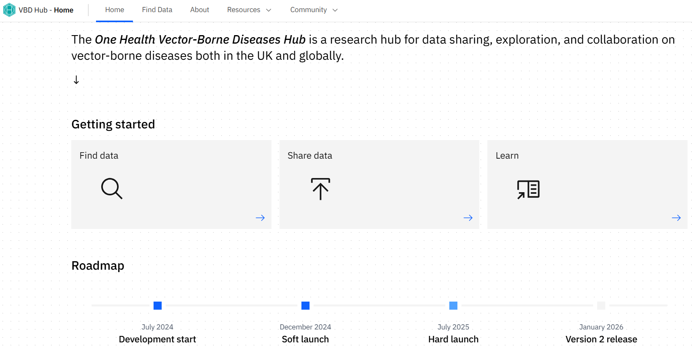
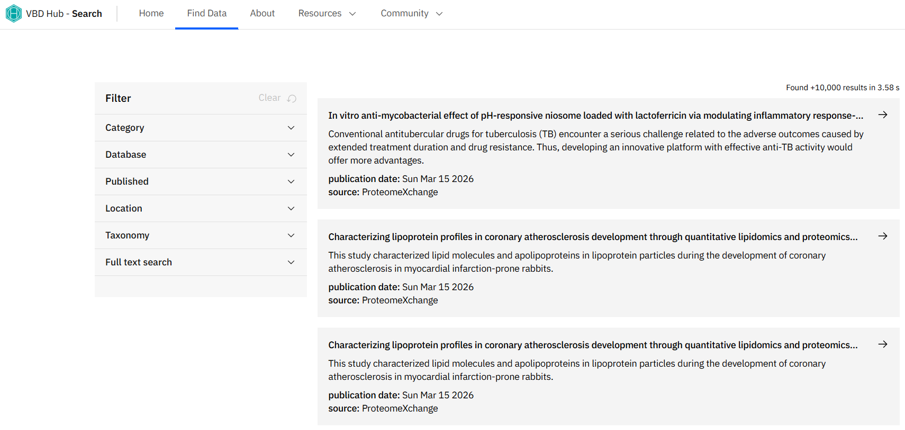
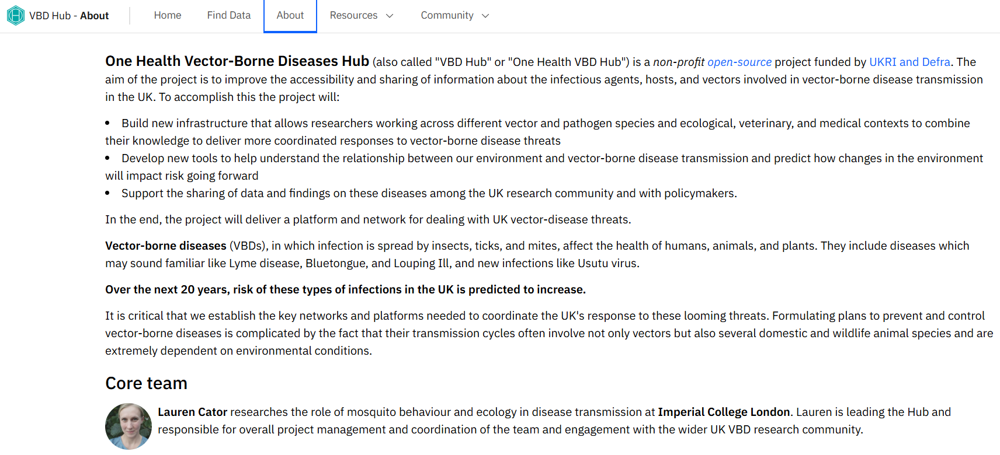
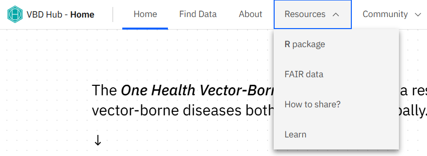
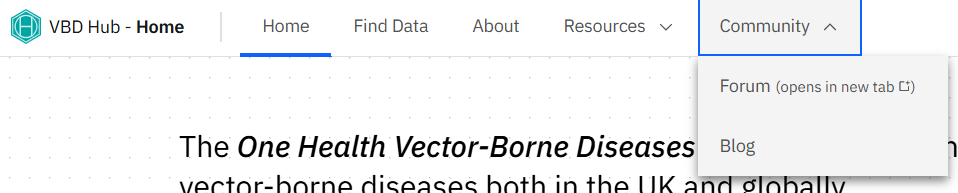
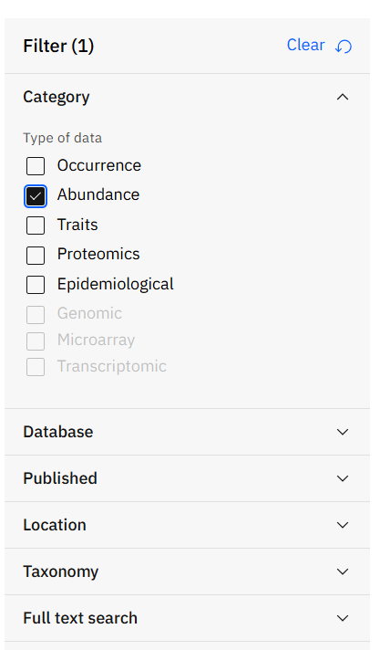

# (PART) Workshop 2:  Data Wrangling with Hub Search & ohvbd {-}

# Introduction

## Learning objectives

**By the end of this workshop, you should be able to:**

1. Use VBD Hub resources to access shared VBD datasets.
2. Effectively wrangle real-world VDB datasets ready for further analysis.
3. Build collaborative, professional connections within the VBD community.


## Prerequisites

**Before participating in this workshop, you should have:**

- Foundational knowledge of programming in R and RStudio, including running code, installing packages, and working within scripts.
- Some experience of formatting datasets in R, such as importing .csv files and viewing dataframes.
- Basic understanding of VBD biology, including common vectors and pathogen transmission.


## Training Plan
### Pre- live session content
This is to be completed ahead of the **Live Session**.
Content will be available on the Hub under [Learning Resources](https://vbdhub.org/resources/learn).


The [VBD Hub Forum](https://forum.vbdhub.org/t/online-training-data-visualisations-in-r/159) is available for support and networking.


### Live session
10:00 - 13:00 on Thursday 26th March, via Teams.


Content will be made available on the Hub under [Learning Resources](https://vbdhub.org/resources/learn) on the day of the **Live Session**.


### Post- Live Session Challenge Task
Multi-stage task to be completed independently after the **Live Session**. The stages will increase in difficulty and provide an opportunity to apply what you have learnt to real VBD datasets.


Content will be posted on the VBD Hub under [Learning Resources](https://vbdhub.org/resources/learn) on the day of the Live Session.
The [VBD Hub Forum](https://forum.vbdhub.org/t/challenge-task-q-a-data-visualisations-in-r/160) will be available for support.


## Navigating Course Content
Many of the tasks in this workshop will be in a workbook-style format and will walk you through how to code specific functions and models. We encourage you to type this code yourself to practice syntax and gain the most out of the content provided, rather than copying and pasting.


All coding through this workshop will be done in Rstudio, a user friendly IDE (integrated development environment) for R language. Please ensure you have R and RStudio installed and updated ahead of the **Live Session**. If you do not already have R or RStudio installed, see [here](https://posit.co/download/rstudio-desktop/).


## Available Materials & Support
If you need a quick reminder of basic coding in R, additional materials and cheat sheets can be found here:

- [Biological Computing in R](https://vbdhub.org/MQB/notebooks/r.html)
- [Data Management (read up to Data visualization)](https://vbdhub.org/resources/learn/training-2025/data-management-and-visualisation)
- [Basic Hypothesis Testing](https://vbdhub.org/MQB/notebooks/t-f-tests.html)
-	[RStudio IDE Cheatsheet](https://rstudio.github.io/cheatsheets/rstudio-ide.pdf)
-	[Data Wrangling with dplyr Cheatsheet](https://rstudio.github.io/cheatsheets/data-transformation.pdf) 


If you need additional support through this workshop:

- The [**Forum**](http://forum.vbdhub.org) is a good place to discuss queries with fellow participants.
- Demonstrators will be available to help during the **Live Session**.
- During the **Challenge Task**, a specific discussion on the Forum will be open to ask demonstrators questions. One-to-one video support will also be available if required.
- For technical support (e.g. trouble accessing content or joining the Teams link), please contact support@vbdhub.org. This is **not** for coding or statistical support.


## Installing Packages
This workshop will use several R packages throughout, please install these ahead of the **Live Session**.


**Packages for this workshop:**

- `ohvbd`
- `tidyr`


::: {.rmdtip}
**Reminder:** To install packages in R, use the `install.packages()` command.


To install one package:
``` r
install.packages("ggplot2")
```

To install multiple packages:
``` r
install.packages(c("ggplot2", "dplyr", "tidyr"))
```
:::


# Pre- Live Session Content


## VBD Hub Overview
The **VBD Hub** is a non-profit, open-source project funded by UKRI and Defra, which aims to improve accessibility and information sharing. To do this, the project builds infrastructure and tools to allow researchers to combine knowledge and share data within the VBD research community and with policymakers.  


The hub site is home to resources to help your research, and spaces for collaboration and networking with the VBD community.


In this session, we will cover some of the key resources available through the **VBD Hub** and how to use them effectively. 


## Navigating VBD Hub
The [VBD Hub website](https://vbdhub.org/) is straightforward to navigate, but if you haven’t used it before it can be useful to know what information you can find and where.


### Home
When you first visit the site, you will see the **Home** screen with a summary of what the Hub is. 


The **Getting started** boxes provide user-friendly links to some of the key information and resources available on the Hub site:

- **Find data**
- **Share data**
- **Learn**


The **Roadmap** covers the progress of the VBD Hub since July 2024. As the Hub continues to grow, new developments will be updated here. 


{width=100%}


### Find Data
The **Find Data** tab is where we find the **Hub Search** resource. This can be used to find open access databases from over 10,000 records within the VBD Hub system. The filter section allows you to refine your search using a number of parameters. 


You may notice this page is linked under the **Getting started** section of the **Home** page.


We will explore this resource in more detail shortly.


{width=100%}


### About
Under the **About** tab, you will find a more in depth overview of the **VBD Hub**, the aims of the Hub, and the critical impact of a platform like this. 


There is also a list of the **Core team**, and their involvement within the Hub.


{width=100%}


### Resources
The Resources tab offers a drop-down menu of four pages:

- **R package** - an overview of the **ohvbd package** for R developed by the Hub, and latest release patch notes. We will explore this in more detail shortly.
- **FAIR data** - this page outlines FAIR data principles (Findable, Accessible, Interoperable, Reusable), which are important to consider with open-access data.
- **How to share?** - provides guidance on standards and privacy of data sharing, and standard operating procedures for specific data types.
- **Learn** - here, you can find learning resources developed by the Hub, such as the content for this workshop!


You may notice some of these are also linked under the **Getting started** section of the **Home** page.


{width=100%}


### Community
The **Community** tab also has a drop-down menu, with links to:

- **Forum** - this opens a new tab to the **VBD Hub Forum**, a space to connect with the VBD community and discuss a variety of topics. We will explore this in more detail shortly.
- **Blog** - announcements will be posted in this space with details of Hub development, contributions, and upcoming opportunities, including this training.


{width=100%}


## VBD Hub Resources & How to Use Them


### Hub Search
As we have seen, the **Hub Search** can be found under the **Find Data** tab on the **VBD Hub** site. 

**Hub Search** makes discovering datasets much easier by searching multiple data sources in one place, allowing you to identify datasets relevant to your research and explore metadata before downloading several individual datasets.

On the **Find Data** page, we can find a **Filter** menu with several drop down options:

- **Category** - filter your search based on data type. Hub Search currently allows you to filter Occurrence, Abundance, Traits, Proteomics, and Epidemiological data. 
- **Database** - filter by source database - VecDyn, VecTraits, GBIF, ProteomeXchange, and VBD Hub.
- **Published** - set the start date and end date of the publications you want to search.
- **Location** - draw polygons around the geographical area you want to search.
- **Taxonomy** - search for a specific taxon.
- **Full text search** - filter your search by more specific text fields.





::: {.rmdnote}
**Note:** Through this workshop, we will discuss resources that search and retrieve data from several open-access VBD databases. If you are unfamiliar with these databases, they include:

- **VecDyn** - vector population dynamics, including how vector populations change over time and across locations. 
- **VecTraits** - vector trait data, such as life history, behavioural, and ecological traits. 
- **GBIF** - species occurrence records on the location and time vector species have been observed.
- **ProteomeXchange** - proteomic and molecular vector data.
- **AreaData** - environmental and geographic data. 
- **NCBI**- genetic and genomic data.

:::


Once we have searched for specific data, we can review the search results. Results typically include the dataset name, the source database, and a brief description of the dataset. 


Clicking on resulting datasets lets us explore that data in more detail, including metadata, geographic or temporal coverage, and access or download options.


After reviewing your data, you might decide to refine your search depending on:

- **Relevance** - does the resulting dataset answer your research question?
- **Coverage** - does the resulting data include the right location or time period for your research?
- **Structure** - is the data in a usable format or file type?


You can refine your search by adding more parameters, trying more specific key words, or combining terms, such as “species + country”.


::: {.rmdtip}
**Tip:** Start broad, then narrow your search by adding more parameters where necessary.


Remember, you don’t have to download everything - you should focus on datasets that are the most useful to you.
:::


### Hub Search Task
Use the **Hub Search** to find datasets on abundance of *Ixodes ricinus*. How many results did your search return?


Select one dataset from your search and identify the:

- Dataset name
- Publication date
- Source database


Use the **Response Form** at the end of the **Pre- Live Session** content to record your answers.


### ohvbd package
**ohvbd** is an R package developed by the **VBD Hub** that allows you to search for and retrieve data within R, without needing to download files from multiple sources.


It connects to several VBD database sources at once, including **VBD Hub** (vbdhub), **VecTraits** (vt), **VecDyn** (vd), **GBIF** (gbif), and **AreaData** (px), and pulls datasets directly into your R workflow.

You can install **ohvbd** from CRAN by running this code in R:


``` {r}
library(ohvbd)
```


**ohvbd** uses a piped workflow, which allows us to build on each step of our code. For example, if we wanted to search for data on *Ixodes ricinus* from the **VecTraits** database, we can run:

```{r include=FALSE}
ixodes_ricinus_data <- readRDS("data/ixodes_vt_data.rds")
```
``` r
ixodes_ricinus_data <- search_hub("Ixodes ricinus") |>
  filter_db("vt") |>
  fetch(connections = 8) |>
  glean()
```


Let’s break this down a bit so we can understand what is happening:

- `search_hub()` - searches for datasets matching your criteria, here we want to search for "Ixodes ricinus".
- `filter_db()` - narrows results to a specific database, in this case “vt”, VecTraits.
- `fetch()` - retrieves the data.
- `glean()` - converts the data into a usable table format.


::: {.rmdtip}
**Tip:** We can consider a basic search with **ohvbd** as 4 stages:

- 1. **Find** the data we are looking for.
- 2. **Filter** the search field.
- 3. **Fetch** the data.
- 4. **Format** the data.

:::


The data we retrieve from **ohvbd** is often raw and its formatting depends on the original source database. After using the package, you will then need to wrangle and analyse the data yourself.


We can make our search more refined by adding more search parameters and retrieving the IDs for any datasets that match those parameters:


``` r
search_hub(
  query = "",
  db = c("vt", "vd", "gbif", "px"),
  fromdate = NULL,
  todate = NULL,
  locationpoly = NULL,
  taxonomy = NULL,
  exact = FALSE,
  withoutpublished = TRUE,
  returnlist = FALSE
)
```


Let’s also break this down so we can understand what each argument does:

- **query** - what you are searching for, such as a species name.
- **db** - which databases we want to search
- **fromdate** - the date we want to search from. 
- **todate** - the date we want to search up to. 
- **locationpoly** - set our search to a geographic area.
- **taxonomy** - advanced search by species ID.
- **exact** - whether to return exact matches only.
- **withoutpublished** - whether to return results without a publishing date when filtering by date.
- **returnlist** - return the raw output list of datasets, rather than a formatted dataframe.


::: {.rmdimportant}
**Important:** When adding parameters, you do not need to use all of these arguments at once. Start simple and build a pipeline that aligns with your search aims.
:::


::: {.rmdtip}
**Tip:** **fromdate** and **todate** use ISO format: yyyy-mm-dd.
:::


### ohvbd Task
Let’s have a go at retrieving data using ***ohvbd**. Consider what we would want to include to search for data on *Aedes aegypti* from **VecTraits**.


We first want to define our search string using `search_hub()`:


``` r
search_hub("Aedes aegypti")
```


Next, we want to filter our search so that data is only retrieved from **VecTraits**:


``` r
filter_db("vt")
```


Now we can combine these lines of code to retrieve and format the data:

```{r, include = FALSE}
aedes_aegypti_data <- readRDS("data/aedesaegypti_vt_data.rds")
```

``` r
aedes_aegypti_data <- search_hub("Aedes aegypti", db = "vt") |>
 filter_db("vt") |>
 fetch(connections = 8) |>
 glean()
```

Notice we also added `fetch()` and `glean()` to our pipeline. These ensure the data is downloaded and formatted for further wrangling and analysis.


Once we have searched and retrieved the data we want, we can inspect the dataset:


``` {r}
head(aedes_aegypti_data)
```


Remember, data retrieved using **ohvbd** can be raw and depends on the format of the source database. When inspecting the data, it is useful to consider:

- What type of data has the search returned?
- How many columns are there?
- Are there any missing values?


Let’s save our data, we will use this later in the workshop:


``` r
write.csv(aedes_aegypti_data, "aedes_aegypti_data.csv", row.names = FALSE)
```


::: {.rmdnote}
**Note:** If you want to practice more examples of using the **ohvbd package**, try looking at these vignettes:

- [Retrieving data from VectorByte](https://cran.rstudio.com/web/packages/ohvbd/vignettes/use-areadata.html)
- [Sourcing climatic data from AREAdata](https://cran.rstudio.com/web/packages/ohvbd/vignettes/use-areadata.html)

:::


### VBD Hub Forum
Earlier in this content, we found the **Hub Forum** under the **Community** tab. The **VBD Hub Forum** is a space to ask questions and share knowledge with the VBD community. 


Discussions on the **Forum** are organised using categories and tags so you can easily find topics relevant to you. When you post in a discussion, this contributes to an ongoing thread with other users. 


You can engage with the **Forum** by:

- Following discussions that interest you.
- Posting a new question or conversation prompt.
- Sharing resources and opportunities.
- Responding to existing threads. 


### VBD Hub Forum Task
Log in or sign up to the [VBD Hub Forum](https://forum.vbdhub.org/) and find the workshop discussion under the Training topic. 


Create a short post to introduce yourself, including your name, research interests, and what you hope to gain from this workshop.


You might want to reply to each others' posts to network with your fellow participants.


## Data Wrangling Principles
Data wrangling is the process of cleaning, transforming, and organising raw data into a format that is suitable for your analysis. 


Data retrieved through the **Hub Search** or the **ohvbd package** will often be raw, with missing values or messy data formats. Understanding data wrangling principles will help you organise your data into usable formats to make further statistical analysis smoother and easier.


### Do’s and Don’ts of Data Wrangling
**1. Understand your data first.**

- **Do:** Explore your data before making any changes. We can look at the first few rows of our dataset using `head()`, which allows us to better understand our data, including checking the column names and data types. 
- **Don’t:** Jump straight into cleaning the data without fully understanding how it is formatted. Without understanding the data, you risk misinterpreting variables and accidentally removing useful data.


**2. Save your raw data.**

- **Do:** Keep an unchanged version of the raw dataset so you can access a previous version if something goes wrong, reproduce your work, and verify your results.
- **Don’t:** Overwrite your original data. When wrangling your data in R, assign your cleaned data to a new object: `clean_data <- raw_data`.


**3. Use clear & consistent naming.**

- **Do:** Use informative column, model, and object names so you know what your object is explicitly. Clear naming makes your R workflow easier for others (and yourself) to understand.
- **Don’t:** Use unclear names or names with messy formatting. Try to avoid spaces, special characters, or specific abbreviations.


**4. Reformat your data.**

- **Do:** Convert your data to long format for analysis, using `pivot_longer()`. In this format, each row represents a single observation, which can make the data easier to filter and analyse.
- **Don’t:** Use data in wide format, where values are spread across multiple columns. This can limit data wrangling and processing, such as grouping across different years and generating effective visualisations.


**5. Record what you do.**

- **Do:** Keep track of your progress by recording what changes you made and why you used that approach. It is good practice to note these changes as comments in your code.
- **Don’t:** Rely on memory alone. It is easy to forget what analytical methods you used, why you chose that approach, and what order you processed your data in. Keeping clear records of your workflow contributes to better reproducibility.


::: {.rmdcaution}
**Frequent Mistake:** R cannot handle spaces in object names. There are a few options for alternative syntax, we would recommend using camelCase where letters are capitalised to indicate new words (e.g. specificModelName), or using an underscore to connect words (e.g. specific_model_name).


If using camelCase, remember that R is case sensitive - if your object is named specificModelName, but you call specificmodelname, R will show an error:


`Error: object ‘specificmodelname’ not found`
:::


### Data Wrangling Task
Let’s have a go at applying these data wrangling principles to the dataset we retrieved using **ohvbd**. 


**1. Understand your data first** - run `head()` before making any changes to your data:


``` {r}
head(aedes_aegypti_data)
```


Notice what the columns represent, what the data types are, and whether there are any missing values.


**2. Save your raw data** - save your data as a new object. Any changes you make will use this new object, rather than the raw data:


``` {r}
clean_aedes_data <- aedes_aegypti_data
```


**3. Use clear and consistent naming** - rename at least two columns with more informative names:


``` {r}
library(dplyr)

clean_aedes_data <- clean_aedes_data |>
  rename(
    original_trait_name = OriginalTraitName,
    original_trait_def = OriginalTraitDef
  )
```


**4. Reformat your data** - check whether your dataset is in wide or long format. Remember, we typically want each row to represent a single observation. If our variables are spread across several columns we can reformat our data using `pivot_longer()`. FOr this dataset, we can see the data is already in long format.


**5. Record what you do** - add comments to your code explaining what changes you made and why:


`# Convert data from wide to long format so it is easier to filter and analyse.`


::: {.rmdnote}
**Note:** Don’t worry if you weren’t able to retrieve a dataset from **ohvbd**, we will recap this in the **Live Session**.
:::


## Response Form 
Please complete this [Response Form](https://docs.google.com/forms/d/e/1FAIpQLSdshvuPxVUR1-87qeZgfGI0fIigrJthmS4S1IzHen3DjggiLQ/viewform?usp=publish-editor) after finishing the tasks above.


This form is anonymous and is not an assessment. Your responses will help us to understand which areas may require more support during the **Live Session**. We aim to tailor the content to the group's needs, so you gain the most from this workshop.


## Conclusion & Preparation for Live Session
Ahead of the live session, ensure you keep R and RStudio installed on your device, as well as the packages we prepared earlier. 


Please make sure you have Teams set up on your device and that your microphone is working. We will aim to send the link 48 hours before the live session. Please be aware that the live session will be recorded. 


# Live Session


## Schedule

- Introduction
- Recap Pre- Live Session Content
- Real World Data is Messy
- Data Wrangling Principles
- Merging Datasets
- Cleaning Species Names
- BREAK
- Planning a Wrangling Workflow
- Collaborative Task
- Share Collaborative Task Results
- BREAK
- What Does Collaboration Mean to You?
- Prepare for Challenge Task
- Conclusion


## Introduction 
Welcome to the **One Health Vector-Borne Diseases Hub Online Training**. My name is Chloё, and I work with the VBD Hub to develop training and workshops, like this session today. We are also joined by our lovely demonstrators, who will be available throughout the session to provide support and answer any questions you have. 


**VBD Hub** is a non-profit, open-source project funded by UKRI and Defra, which aims to improve accessibility and information sharing. To do this, the project builds infrastructure and tools to allow researchers to combine knowledge and share data within the VBD research community and with policymakers.  


Our focus today is **Data Wrangling with Hub Search and ohvbd**. By the end of this training, you should be able to: 

- Use **VBD Hub** resources to access shared VBD datasets.
- Effectively wrangle real-world VDB datasets ready for further analysis.
- Build collaborative, professional connections within the VBD community.


In the **Pre- Live Session** content, you will have seen links to recap materials and cheat sheets. Feel free to use these if you need any reminders. If you need additional support, the [Forum](https://forum.vbdhub.org/c/training/13) is a good first point of call where you can discuss queries with fellow participants. Our **demonstrators** will keep an eye on the chat during this call and can provide more support during tasks. 


The written version of this content is now available on the [VBD Hub website](https://vbdhub.org/resources/learn) if you wish to follow along with this format. These written materials will be available for you to access in future, including the code examples. You are welcome to follow along with the walkthrough code in this **Live Session**, but there is no pressure, and you can have a go at the code yourself later. 


If you have any technical difficulties or lose connection, try joining the meeting again when you can. If you need technical support, please contact support@vbdhub.org (**note:** this is only for technical support, not statistical support or questions on the course content). 


We have breaks scheduled into this session, but if you need to step away for a few minutes at all, feel free to do so quietly. 


## Recap Pre- Live Session Content 
In the **Pre- Live Session** content, we covered:

- Navigating the **VBD Hub** website and where to find key resources.
- Using **Hub Search** and the **ohvbd package** to search and retrieve data.
- Discussing various topics with the VBD community on the **VBD Hub Forum**.
- Applying data wrangling principles to real-world datasets.  


During the tasks, we tried identifying patterns and details out the datasets and proposing hypotheses from our visualisations:

- 1. **Hub Search:** How many results did your search for abundance data on Ixodes ricinus return?
- 2. **Hub Search:** What is the name, publication data, and source database of your selected dataset?
- 3. **Data wrangling:** What data types did you see in the ohvbd dataset?


It is normal if you found some of this content challenging, it can sometimes be tricky when you are getting your head around new resources.


In the **Pre-Live Session** content, we used `search_hub()` in the **ohvbd package** to search and retrieve datasets. This is the base function for an **ohvbd** search, and is useful for data exploration. However, if you know what you are looking for, you can make this process more efficient by specifying the source database directly into the fetch:


``` r
search_hub("ixodes ricinus", db = "vt")
```


This approach is typically significantly faster as it avoids retrieving unnecessary GBIF metadata. 


::: {.rmdtip}
**Tip:** You can write `?search_hub` or `?fetch_vt` in the R console to access guide documents if you need extra help using **ohvbd**.
:::


## Real World Data is Messy 
Real-world VBD data is rarely clean, especially if it has been collected for different purposes or recorded using different reporting standards. 


Before making any changes to your datasets, it is important to understand how your dataset is formatted so you can apply the most appropriate wrangling and cleaning approaches. When working with VBD datasets, you may come across:

- Missing values
- Inconsistent data types
- Poorly named columns
- Duplicate records
- Data stored in inconvenient formats.


Rather than viewing each of these issues separately, it can be useful to recognise common patterns. For instance:

- Inconsistent naming - affects merging
- Mixed data types - affects calculations
- Wide format - affects analysis and visualisations


When we think about data inconsistency patterns in this way, we shift our focus from problems to decisions. Each issue you identify in your dataset requires a decision:

- Should missing values be removed or retained?
- Should columns be renamed or merged?
- Should data be formatted from wide to long format?


When we stop asking **"what is wrong with this dataset?"** and start thinking **"what do I need this dataset to do?"**, we can make informed decisions and prioritise the most appropriate data wrangling approaches to your data and research question. 


## Data Wrangling Principles
Data wrangling is a broad topic, and there is no single "correct" way to wrangle data. The methods you choose to wrangle your data will depend on your research question, the type of data you are working with, and how it is formatted.


When we access **VBD data** using tools like Hub Search or the **ohvbd package**, we typically retrieve data from different sources. These sources might use slightly different formats, names, and details, and therefore need to be wrangled before we use them for analysis.


People typically think of data wrangling as a list of set steps to work through. Try to reframe data wrangling as a process of making your data fit for your research - the goal is to make the data usable and reliable for your own specific analysis. 


::: {.rmdnote}
**Note:** You might repeat some data wrangling principles across different datasets, but for each new dataset, try to consider how you want the data to look for the analysis you are planning to use.
:::


There are numerous ways to wrangle your data, including filtering rows, converting data types, handling missing values, and standardising units. 


We cannot cover every data wrangling principle within a single training session. Today, we will focus on two methods commonly applied to VBD data:

- 1. Merging data.
- 2. Cleaning species names.


## Merging Datasets
Often, research workflows incorporate more than one dataset as it is rare for a single dataset to contain all the information you need to answer your research question. For instance, you might have one dataset on species abundance data and another on environmental variables. If you want to analyse how the environment influences species abundance, you will likely want to combine these into a single dataset.


We call this **merging** or **joining** datasets. 


For a merge to work effectively, both datasets must share at least one common column name. This is often referred to as a **key**. In VBD datasets, a common key might be a species name, a location, or a date. 


Let’s imagine we have two datasets which both contain a column called species. We can merge these two datasets using the `left_join()` function from the `dplyr` package:


``` r
library(dplyr)

merged_data <- left_join(dataset_a, dataset_b, by = "species")
```

This function keeps all the rows from `dataset_a` and adds matching information from `dataset_b` where the species value is the same.


There are different types of merges or joins, each of which acts slightly differently:

- A **left join** keeps all the rows from the first dataset and adds matching values from the second. This is a safe choice when you do not want to lose data.
- An **inner join**, `inner_join()`, only keeps the rows that appear in both datasets. Useful when you are only interested in complete matches, but risks accidental data loss.
- A **full join**, `full_join()`, keeps all the rows from both datasets, filling in missing values where matches do not exist. This can be helpful in exploratory work but may require further downstream data cleaning.


Choosing which merge to use depends on your research question and how you want to format rows that don’t align across datasets.


We can also merge by multiple columns when a single column is not enough to uniquely identify a match. For example, in VBD research, we might need to merge by species and location:


``` r
merged_data <- left_join(dataset_a, dataset_b, by = c("species", "location")
```


When we set multiple key columns, we ensure that matches only occur when both the species and the location align. This is particularly useful when working with ecological or epidemiological data, where the species might appear in multiple regions and should be accounted for with this in mind.


Merging is usually straightforward, but it can become tricky when we assume the key represents the same thing in both datasets, but the data contains inconsistencies. For example, if `dataset_a` formats species names as `"Ixodes ricinus"` and `dataset_b` formats species names as `"ixodes_ricinus"`, R will not identify these species as a match for merging.


::: {.rmdcaution}
**Frequent mistake:** A **successful merge** does not always guarantee a **correct merge**. Even if your code runs without errors, the result may not be what you were aiming for. It is important to check whether the new, merged dataset makes sense, for instance has the number of rows changed drastically, are there missing values in the new columns, and do the matches look correct?


A useful quick check is:


``` r
nrow(dataset_a)
nrow(merged_data)
```


This will check the number of rows in the original dataset and the new, merged dataset. A significant increase in the number of rows might suggest duplicate matches, and a significant decrease indicates you might have lost data.
:::


## Cleaing Species Names 
Species names are one of the most common causes of inconsistency when merging datasets from multiple sources. 


Small formatting differences can prevent datasets from merging correctly or cause inaccuracies in later analyses. Mismatched species names are usually caused by:

- Differences in capitalisation - `"Ixodes ricinus"` or `"IXODES RICINUS"`.
- Using spaces or underscores - `"ixodes ricinus"` or `"ixodes_ricinus"`.
- Extra text, such as "spp." - `"Ixodes ricinus spp."`.
- Duplicate rows for the same species.


Although we know these all represent the same species, R will recognise each differently formatted name as a different value.


A good starting point when standardising species names is setting all text to lowercase:


``` r
clean_data <- clean_data |>
 mutate(species = tolower(species))
```


We can also make sure species names in our data don’t have any unwanted characters, such as underscores:


``` r
clean_data <- clean_data |>
 mutate(species = gsub("_", " ", species))
``` 


Or additional text, such as "spp.":


``` r
clean_data <- clean_data |>
 mutate(species = gsub(" spp\\.", "", species))
``` 


Or any extra spaces:


``` r
clean_data <- clean_data |>
 mutate(species = trimws(species))
``` 


If species names are not standardised across our datasets:

- Merges between datasets could fail.
- Duplicate species entries might be created.
- Analyses might produce inaccurate results.


### Example
Let's imagine we have used **ohvbd** to retrieve a dataset on mosquito abundance, `mosquito_abundance_data`, and another dataset on mosquito habitats, `mosquito_habitat_data`, in order to analyse patterns of abundance dependent on habitat type:

```{r include=FALSE}
mosquito_abundance_data <- data.frame(
  species = c("Aedes aegypti", "Culex pipiens", "aedes_aegypti", "Culex pipiens spp."),
  location = c("Site1", "Site1", "Site2", "Site2"),
  abundance = c(10, 5, 12, 7)
)

mosquito_habitat_data <- data.frame(
  species = c("aedes aegypti", "culex pipiens", "aedes aegypti", "culex pipiens"),
  location = c("Site1", "Site1", "Site2", "Site2"),
  habitat = c("urban", "wetland", "urban", "wetland")
)
```


```{r}
mosquito_abundance_data

mosquito_habitat_data
```


We can try to merge these datasets in their raw format:


```{r}
library(dplyr)

merged_mosquito_data <- left_join(
  mosquito_abundance_data,
  mosquito_habitat_data,
  by = c("species", "location")
)
```


Let’s double check what our data looks like using `head()` and `nrow()`:


```{r}
head(merged_mosquito_data)
nrow(merged_mosquito_data)
```


Oh dear! We can see that our merge has run, but the rows have not matched correctly. We would expect a habitat column from the dataset we wanted to combine, but this isn't showing because something has gone wrong in the merge. 

This is because the species names are formatted differently across the two datasets, so R has treated these as different values. Although the locations match, both the location **and** species need to match exactly for the merge to work.


Let's have a look at our original data:
```{r}
head(mosquito_abundance_data)

head(mosquito_habitat_data)
```


We can see some inconsistencies with our species names, including:

- Difference in capitalisation 
- Using underscores instead of spaces 
- Additional text 


Let’s make sure all our species names are lowercase and remove unwanted formatting:


```{r}
clean_mosquito_abundance_data <- mosquito_abundance_data |>
  mutate(species = tolower(species)) |>
  mutate(species = gsub("_", " ", species)) |>
  mutate(species = gsub(" spp\\.", "", species))

clean_mosquito_habitat_data <- mosquito_habitat_data |>
  mutate(species = tolower(species)) |>
  mutate(species = gsub("_", " ", species)) |>
  mutate(species = gsub(" spp\\.", "", species))
```


Now that our species names are consistent, we can try merging again:


```{r}
merged_mosquito_data <- left_join(
  clean_mosquito_abundance_data,
  clean_mosquito_habitat_data,
  by = c("species", "location")
)

head(merged_mosquito_data)
nrow(merged_mosquito_data)
```


We can see that now our species names are consistent, the merge has worked as expected. Each row has been correctly matched by both species and locations, so the habitat data has been correctly combined with the abundance data. The dataset is now in a usable format for further wrangling and analysis.


::: {.rmdcaution}
**Frequent mistake:** People often only clean one dataset before merging, but data for the key column needs to be consistent across both datasets for the merge to be successful.
:::


So far, we have used straightforward approaches such as converting all text to lowercase and removing consistent unwanted characters like "spp.". These techniques are useful starting points, but species names in real VBD datasets often contain more complex inconsistencies.


More complex cases might involve:

- Abbreviated genus names - `"I. ricinus"`.
- Additional descriptors contributing to varied additional text - `"Ixodes ricinus aff."` or `"Ixodes ricinus cf."`.
- Mixed formatting within the same column.


In these cases, you may need to think critically about what formatting should be retained and what should be removed, and require more steps to clean the data. For instance, if we had a dataset where the species name contained these values:

- `"Ixodes ricinus"`
- `"Ixodes_ricinus"`
- `"Ixodes ricinus spp."`
- `"IXODES RICINUS"`
- `"I. ricinus"`


If we apply our earlier name cleaning techniques, we might standardise most of these species name formats, but `"I. ricinus"` would remain as is, and R would process this as a different value. 


In situations like this, where not all inconsistencies can be solved with simple text replacement, you will likely need to inspect unique values in your dataset:


``` r
unique(clean_data$species)
```


This allows you to see all the distinct values in the species column, so that you can identify inconsistent formats, such as `"I. ricinus"`, and decide on a consistent naming format for your data.


Specific cases might need to be manually recoded:


``` r
clean_data <- clean_data |>
  mutate(species = ifelse(species == "i. ricinus", "ixodes ricinus", species))
```


As species columns are typically used as a key when merging in VBD research, ensuring species names are consistent across our datasets can allow us to merge multiple datasets more confidently and reliably.


::: {.rmdtip}
**Tip:** Automating our workflow feels much easier, but it is important to balance this with manual reviewing to ensure you don’t miss specific cases like these. To support this balance, we can use a three step approach:

- 1. Apply broad cleaning techniques - ensure all text is lowercase, remove underscores, remove common additional text.
- 2. Inspect the results using `unique()`.
- 3. Manually correct any remaining inconsistencies.
:::


### (optional) Resolving species names using GBIF
When using large or messy datasets, an alternative approach you might choose is to match your species names against a recognised taxonomic database. 


The `rgbif` package can be used to help standardise species names using the Global Biodiversity Information Facility (GBIF). We can use the `name_backbone()` function to try to match your species name input to a standardised species name in the GBIF backbone taxonomy:


``` r
library(rgbif)

name_backbone(name = "ixodes ricinus")
```


This approach can help to identify spelling or formatting errors and synonymous species names when simple cleaning techniques are insufficient for your dataset.  


::: {.rmdnote}
**Note:** In this training session, we will focus on using the cleaning techniques we discussed earlier, rather than using GBIF.
:::


## Planning a Wrangling Workflow
We have discussed how to reframe data wrangling as a process, rather than a rigid set of steps.


When you open a new dataset, it can be tempting to start making changes immediately. To relieve this temptation, we can be prepared with a guide to a practical workflow that leaves room for flexibility to account for your specific dataset and research questions.


**Guide to a practical, but flexible workflow:**

- **Inspect the data** - understand the structure, variables, and data types.
- **Identify any issues** - look for inconsistencies, missing values, and formatting problems.
- **Prioritise tasks** - decide which issues are most important for your analysis.
- **Apply cleaning steps** - after you understand the data, use appropriate data wrangling approaches.
- **Check results** - ensure the changes you have made have worked in the way you expected.


Without a clear workflow, it is easy to lose track of the changes you have made, and introduce new errors, especially if you don’t check your results.


Approaching data wrangling in this way helps to ensure your work is reproducible, efficient, and aligned with your research aims. 


::: {.rmdtip}
**Tip:** To keep track of your workflow, add comments to your code explaining what changes you made and why:


`# Convert data to all lowercase to ensure consistency across datasets.`
:::


## Collaborative Task 
Let’s have a go at applying what we have learnt so far by working together in breakout rooms. Each group will be given a short example of data wrangling code, along with a small dataset. The code contains errors or issues for you to work collaboratively to identify and fix. 


Together, you will:

- Identify what the code is trying to do.
- Discuss how you might approach and debug any errors or problematic code. 
- Edit and improve the code so that it runs without errors and produces effective results.
- Prepare to give a brief summary on why your group made those changes when we return to the main meeting room.


To work productively as a group, you might choose to delegate responsibilities, for example, one person might run the code, one might take notes, and one might guide the discussion. There will be a demonstrator in each group to support your work and answer any questions you might have. 


The aim of this activity is not to produce perfect code or script, but to apply what you have learnt so far and think critically about data wrangling principles. Reflecting on your decisions is an important part of developing effective data wrangling skills. 


After completing the task in your breakout room, we will join the main room again. Each group will be able to share the changes they made to wrangle their dataset, and why they made these decisions.


### Example 1
``` r
# Dataset A
data_a <- data.frame(
  species = c("aedes aegypti", "culex pipiens", "anopheles gambiae"),
  abundance = c(10, 25, 5)
)

# Dataset B
data_b <- data.frame(
  Species = c("aedes aegypti", "culex pipiens", "anopheles gambiae"),
  trait = c("urban", "rural", "rural")
)

# Merge datasets
merged_data <- left_join(data_a, data_b, by = "Species")
```


### Example 2
``` r
# Dataset
data <- data.frame(
  species = c("Aedes aegypti", "aedes_aegypti", "Aedes aegypti spp."),
  abundance = c(10, 12, 8)
)

# Clean species name
clean_data <- data |>
  mutate(species = tolower(Species)) |>
  mutate(species = gsub("spp.", "", species))
```


### Example 3
``` r
# Dataset A
data_a <- data.frame(
  species = c("aedes aegypti", "culex pipiens", "anopheles gambiae"),
  abundance = c(10, 25, 5)
)

# Dataset B
data_b <- data.frame(
  species = c("aedes aegypti", "culex pipiens"),
  trait = c("urban", "rural")
)

# Merge datasets
merged_data <- inner_join(data_a, data_b, by = "species")
``` 


### Example 4
``` r
# Dataset A
data_a <- data.frame(
  species = c("aedes aegypti", "aedes aegypti", "culex pipiens"),
  location = c("site1", "site2", "site1"),
  abundance = c(10, 15, 20)
)

# Dataset B
data_b <- data.frame(
  species = c("aedes aegypti", "culex pipiens"),
  location = c("site1", "site1"),
  temperature = c(25, 22)
)

# Merge datasets
merged_data <- left_join(data_a, data_b, by = "species", "location")
```


::: {.rmdtip}
**Tip:** For all examples, remember to run `head()` and `nrow()` to assess the new datasets and if changes you made have worked as expected.
:::


## Share Results from Collaborative Task 
We will now share how each group wrangled their data. Remember, the aim of this discussion is to understand the reasoning behind the changes that each group made. 


For each dataset, a member of each group is invited to explain:

- What the code was trying to do.
- What issues the group identified.
- What changes the group made to fix the code.
- Why the group chose those changes. 


Hopefully, this task has reinforced the data wrangling principles we have discussed so far, and developed our understanding of how reformatting our data effectively contributes to a reproducible workflow and smoother downstream analyses.


By comparing workflows used by each group, we can see that there are multiple ways to approach data wrangling, depending on the dataset and research question.


## What Does Collaboration Mean to You? 
So far in this session, we have focused on applied data wrangling skills in the context of VBD datasets. These skills are important when we retrieve data from **VBD Hub** resources such as **Hub Search** and **ohvbd**. 


However, in the **Pre- Live Session** content we also explored the **VBD Hub Forum**, and introduced the idea of collaboration. 


Collaborations refer to working with others to support research and improve outcomes. They can take many forms, it may include:

- Sharing datasets
- Providing feedback on analysis
- Working together on joint papers or presentations
- Contributing to community discussions.


Different people want different things from collaborations. Some might be looking to share their data or resources, others might want support with their analysis, and others might be interested in developing long-term research networks.


With this in mind, let’s hear from you:

- Why do you want to collaborate?
- What do you think makes a collaboration successful?
- What challenges might you expect in collaborative work?


Good collaborations often involve clear communication, shared goals, and transparency in methods and data. 


Collaborations can be challenging when expectations are unclear, record keeping is limited, or communication is poor. 


The VBD Hub is built to support collaborations within the VBD community by providing resources to access shared datasets and a Forum for discussion and knowledge sharing. 


How might you use the **VBD Hub Forum** to support your own research or collaborations? 


Combining the ability to use resources such as **Hub Search** and **ohvbd**, applied data wrangling skills, and the value of collaboration will prepare you to set up effective workflows for your own independent and collaborative future research.


## Preparing for the Challenge Task 
The final session of this training will provide an opportunity for you to independently apply the skills and concepts discussed throughout the **Pre-** and **Live Session** content, including:

- Navigating the **VBD Hub** website and where to find key resources.
- Using **Hub Search** and the **ohvbd package** to search and retrieve data.
- Data wrangling techniques commonly applied to VBD datasets, including merging and fixing species names.
- Practice applying data wrangling principles to real-world datasets.  
- Using the **VBD Hub Forum**  and collaborating within the VBD community.


The **Challenge Task** will have multiple levels and is designed to encourage applied thinking. Feel free to work through the levels that apply to you, but we encourage you to try all levels to make the most of the training. 


During the **Challenge Task**, we encourage you to experiment with different approaches and discuss potential difficulties with each other via the [VBD Hub Forum](https://forum.vbdhub.org/t/challenge-task-q-a-data-wrangling-with-hubsearch-and-ohvbd/162). Our demonstrators and I will be monitoring the **Forum** if you need any additional support. 


We encourage you to have a go at the task on your own, but a walkthrough version will be released after a few hours, should you need additional guidance.


## Conclusion
Throughout this workshop, we have explored how to search, retrieve, and wrangle VBD data so that we have a better understanding of the datasets we are working with, ready for effective further analysis. 


We began by retrieving datasets with the **Hub Search** and **ohvbd**, and applying foundation data wrangling principles, such as using informative names and converting from wide to long format. We then introduced two data wrangling techniques commonly used in VBD research: merging and fixing species names, and worked together to apply these to real VBD datasets. Finally, we discussed effective collaborations, and how these can be supported by using the **VBD Hub Forum**. 


Effective data wrangling and collaboration are valuable skills for researchers working with complex datasets. By carefully considering how data are formatted, we can ensure our work is reproducible and suitable for further analyses. Clear, consistent and reproducible datasets support positive collaborations by allowing everyone involved to understand the data used to answer the group’s research questions.


# Challenge Task


## Introduction
This Challenge Task provides an opportunity for you to independently apply the skills and concepts discussed throughout this online training, including:

- Navigating the **VBD Hub** website and where to find key resources.
- Using **Hub Search** and the **ohvbd package** to search and retrieve data.
- Data wrangling techniques commonly applied to VBD datasets, including merging and fixing species names.
- Practice applying data wrangling principles to real-world datasets.  
- Using the **VBD Hub Forum** and collaborating within the VBD community.


The **Challenge Task** has multiple levels and is designed to encourage applied thinking. Feel free to work through the levels that apply to you, but we encourage you to try all levels to make the most of the training. 


During the **Challenge Task**, we encourage you to experiment with different approaches and discuss potential difficulties with each other via the [VBD Hub Forum](https://forum.vbdhub.org/t/challenge-task-q-a-data-wrangling-with-hubsearch-and-ohvbd/162). Our demonstrators and I will be monitoring the **Forum** if you need any additional support. 


After approximately 2 hours, a workbook version of this challenge will be made available on the [Online Training site](https://vbdhub.org/resources/learn). This is not an answer sheet, and we encourage you to continue coding yourself, rather than reading through the solutions. This workbook will walk you through the tasks like in the examples used throughout the training, but with a bit more independence before providing the answers.


## Level 1 - Retrieve a dataset
Use the **ohvbd package** to find and retrieve a VBD dataset of your choice. Feel free to choose a dataset that aligns with your own interest, but try to choose one that includes species data, location data, and environmental or trait variables. 


View your dataset:

- Identify the data types and potential key columns. 
- Check if your data contains missing values or inconsistent column names. 
- Consider whether your dataset needs converting from wide to long format.


## Level 2 - Wrangle your data
Apply at least two data wrangling techniques to improve the usability of your dataset. Consider why you chose those changes for your specific dataset.


## Level 3 - Cleaning species names
Identify the species column of your dataset and check if the species names are formatted consistently. Apply name cleaning techniques where appropriate.


## Level 4 - Merging datasets
For this level, you have a choice of two options:


**Level 4a** - Find a second dataset that can be combined with your first, for instance, if your first dataset focused on mosquito abundance, you might look for a second dataset on environmental factors. Identify a suitable key and try to merge the datasets.


**Level 4b** - If a suitable second dataset is not available, focus on preparing your first dataset for merging by identifying potential key columns and whether they are in a usable format. 


::: {.rmdtip}
**Tip:** We recommend trying **Level 4a** to make the most of this training session.
:::


## Level 5 - Share and collaborate
Share a short summary of your wrangling process on the **VBD Hub Forum**, including:

- The dataset you chose.
- The wrangling steps you applied and why you chose them.
- Any challenges you came across. 


Encourage each other by responding to other participants’ summaries - you could ask questions about their process, provide feedback, or suggest an alternative approach. 


# Reading & Resources

- [VBD Hub](https://ohvbd.vbdhub.org/)
- [Hub Search](https://ohvbd.vbdhub.org/reference/search_hub.html)
- [ohvbd: One Health VBD Hub](https://cloud.r-project.org/web/packages/ohvbd/index.html)
- [Citing data retrieved using ohvbd](https://ohvbd.vbdhub.org/articles/citations.html#a-basic-example)
- [Retrieving data from VectorByte](https://cran.r-project.org/web/packages/ohvbd/vignettes/retrieving-data.html)
- [Sourcing climatic data from AREAdata](https://cran.rstudio.com/web/packages/ohvbd/vignettes/use-areadata.html)


