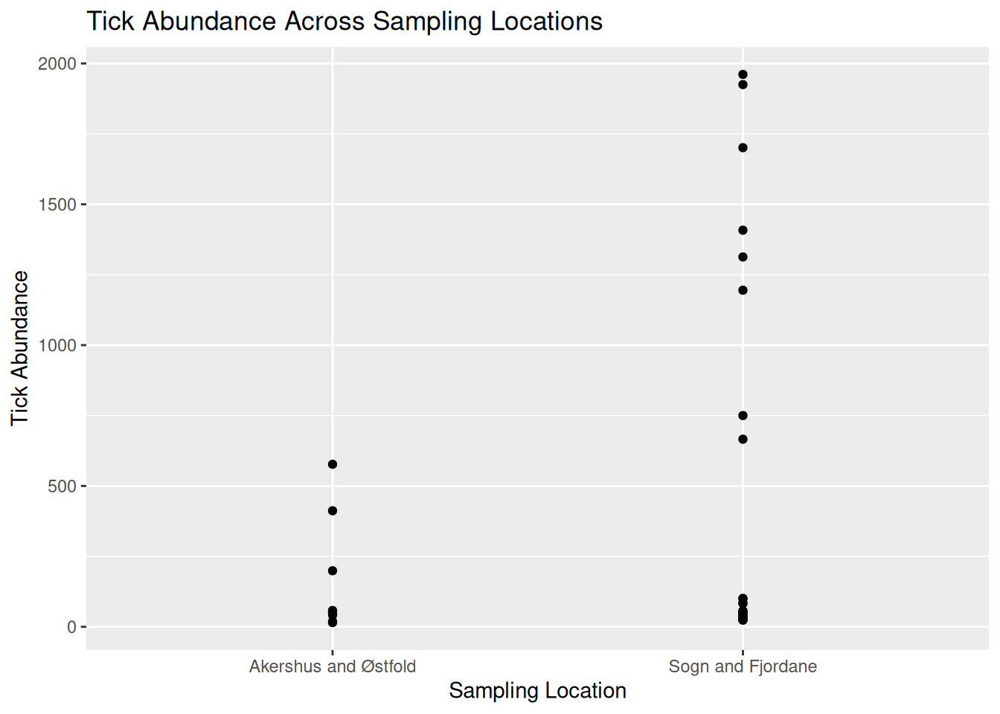

# Welcome {-#homepage}

_Welcome to the One Health VBD Hub (vbdhub.org) 2026 training workshops!_

_On this site you will find the course materials and pre-work for these sessions._

<div style="text-align: center;">


</div>


These workshops have been developed to provide online training to the VBD community, and cover two topics:


**Data visualisations in R** covers visualisations commonly used in VBD research, such as abundance plots, and how we can develop these into effective visualisations. We also consider patterns and data details that can be extracted from visualisations, and how to ensure visualisations are accessible to different audiences. 


**Data wrangling with Hub Search and ohvbd** involves navigating VBD Hub and the available resources to access VBD datasets. We will run practical examples with real VBD datasets, including accessing and wrangling complex datasets in preparation for further analyses. 


The live workshops will run in March 2026, but these resources will be available for long term access. 


The aim of these workshops is provide researchers with the skills to improve data communication and sharing with a variety of audiences, including academics, policymakers, and members of the public.


_Intro stuff goes here_

<!--chapter:end:index.Rmd-->

# (PART) Workshop 1: Data Visualisations in R {-}

# Introduction


## Learning objectives

**By the end of this workshop, you should be able to:**

1. Generate accessible visualisations to communicate complex data to different audiences and stakeholders.
2. Formulate data-driven hypotheses from effective data visualisations.
3. Build collaborative, professional connections within the VBD community.


## Prerequisites

**Before participating in this workshop, you should have:**

- Foundational knowledge of programming in R and RStudio, including running code, installing packages, and working within scripts.
- Some experience of formatting datasets in R, such as importing .csv files and viewing dataframes.
- Basic understanding of VBD biology, including common vectors and pathogen transmission.


## Training Plan

### Pre- live session content
This is to be completed ahead of the **Live Session**.
Content will be available on the Hub under [Learning Resources](https://vbdhub.org/resources/learn).


The [VBD Hub Forum](https://forum.vbdhub.org/t/online-training-data-visualisations-in-r/159) is available for support and networking.


### Live session
10:00 - 13:00 on Thursday 19th March, via Teams.


Content will be made available on the Hub under [Learning Resources](https://vbdhub.org/resources/learn) on the day of the **Live Session**.


### Challenge Task
Multi-stage task to be completed independently after the **Live Session**. The stages will increase in difficulty and provide an opportunity to apply what you have learnt to real VBD datasets.


Content will be posted on the VBD Hub under [Learning Resources](https://vbdhub.org/resources/learn) on the day of the Live Session.
The [VBD Hub Forum](https://forum.vbdhub.org/t/challenge-task-q-a-data-visualisations-in-r/160) will be available for support.


## Navigating Course Content
Many of the tasks in this workshop will be in a workbook-style format and will walk you through how to code specific functions and models. We encourage you to type this code yourself to practice syntax and gain the most out of the content provided, rather than copying and pasting.


All the datasets in this workshop have been tidied and wrangled for you. This is so we can focus on the key themes within this session - effective visualisations and graphics. Raw data is also provided, and we recommend you take a look at the “before” and “after” to better understand the data we are working with. 


All coding through this workshop will be done in Rstudio, a user friendly IDE (integrated development environment) for R language. Please ensure you have R and RStudio installed and updated ahead of the **Live Session**. If you do not already have R or RStudio installed, see [here](https://posit.co/download/rstudio-desktop/).


## Available Materials & Support
If you need a quick reminder of basic coding in R, additional materials and cheat sheets can be found here:

- [Biological Computing in R](https://vbdhub.org/MQB/notebooks/r.html)
- [Data Management (read up to Data visualization)](https://vbdhub.org/resources/learn/training-2025/data-management-and-visualisation)
- [Basic Hypothesis Testing](https://vbdhub.org/MQB/notebooks/t-f-tests.html)
-	[RStudio IDE Cheatsheet](https://rstudio.github.io/cheatsheets/rstudio-ide.pdf)
-	[Data Wrangling with dplyr Cheatsheet](https://rstudio.github.io/cheatsheets/data-transformation.pdf) 


If you need additional support through this workshop:

- The [**Forum**](http://forum.vbdhub.org) is a good place to discuss queries with fellow participants.
- Demonstrators will be available to help during the **Live Session**.
- During the **Challenge Task**, a specific discussion on the Forum will be open to ask demonstrators questions. One-to-one video support will also be available if required.
- For technical support (e.g. trouble accessing content or joining the Teams link), please contact (email). This is **not** for coding or statistical support.


## Installing Packages
This workshop will use several R packages throughout, please install these ahead of the **Live Session**.


**Packages for this workshop:**

- `ggplot2`
- `tidyverse`
- `lubridate`


::: {.rmdtip}
**Reminder:** To install packages in R, use the `install.packages()` command.


To install one package:
``` r
install.packages("ggplot2")
```

To install multiple packages:
``` r
install.packages(c("ggplot2", "dplyr", "tidyr"))
```
:::


# Pre- Live Session Content


[link to optional recap of linear models and basic plots](#recap)


## Commonly Used Visualisations for VBD Data
Different types of data need different types of visualisations.


Choosing the appropriate plot to best represent your data is important to communicate your data and the proposed patterns clearly and accurately. 


In VBD research, common visualisations you might come across include:

- **Scatter plots** - useful to explore relationships between variables.
- **Boxplots** - useful to compare distributions between groups.
- **Line plots** - useful to visualise trends over time.
- **Bar plots** - useful to compare values between groups.
- **Maps** - useful to show spatial patterns.


In vector surveillance research, one of the most useful and frequently used visualisations is abundance plots. These can be used to show how vector counts change over time or across locations.


Abundance plots typically use lines to communicate overall trends in vector populations. However, points can also be used to show individual observations within the dataset. This can be particularly useful during exploratory analysis as it allows us to visualise variation in the data and identify outliers.


Throughout this training, we will focus on developing effective abundance plots with real VBD datasets. We will start with simple exploratory abundance plots in this **Pre- Live Session** content, and build more complex abundance plots during the **Live Session**.


## What can Visualisations Tell Us About Data?
Effective visualisations can help us to communicate complex datasets by quickly identifying distributions and patterns in the data that can be unclear from dataframes alone. 


Visualising data can help us to identify:

- **Distribution of data** - how values are spread across a dataset, including the spatial distribution of vectors or pathogens. 
- **Correlative relationships** - potential associations between multiple variables, such as vector populations and environmental factors.
- **Temporal trends** - variable changes over time, for example, vector abundance over time.
- **Inter-group comparisons** - differences between groups, for instance, vector species across regions.
- **Outliers or anomalies** - unexpected observations that may suggest errors to be addressed before modelling.


Given how much information we can extract from them, visualisations are often the first step in exploratory data analysis before further statistical modelling.


### Task 1: Visualising Tick Abundance Across Locations 
Let’s try visualising some VBD data. First, download [tick_dataset_wrangled.csv](https://github.com/One-Health-VBD-Hub/vbd-hub-training-workshops/blob/main/data/tick_dataset_wrangled.csv) and open it in RStudio:


``` r
tick_data <- read.csv("tick_dataset_wrangled.csv")
tick_data
```


This dataset contains tick abundance, `sample_value`, across two sampling locations, `sample_location`.


::: {.rmdcaution}
**Where most people make mistakes:** Remember to save tick_dataset_wrangled.csv to an appropriate **working directory** and **set your working directory** correctly in RStudio!
:::


We can plot this data to visualise the difference in abundance across the two sample locations. You might typically see bar plots used to visualise abundance across two groups, but here we will use a scatter plot to show individual observations, which allows us to assess variation and identify potential outliers in the dataset.


To do this, we will use the `ggplot2` package. `ggplot2` is one of the most commonly used packages for visualisations and graphics, so it is useful for you to understand how to code with this package. It is particularly good to build plots step-by-step by defining:

- The dataset we want to use.
- The variables we want to visualise.
- The type of plot we want to generate.


Run this code to generate a simple abundance plot of `tick_data` using points to show individual observations:


``` r
library("ggplot2")

tick_abundance_location <- ggplot(tick_data, aes(x = sample_location, y = sample_value)) +
geom_point() +
labs(
x = "Sampling Location",
y = "Tick Abundance",
title = "Tick Abundance Across Sampling Locations"
)

tick_abundance_location

```


You should now see a simple abundance plot in the “Plot” window of RStudio, which looks like this:


``` r
tick_abundance_location
```




::: {.rmdtip}
**Tip:** Using ggplot2 to code visualisations can look heavy, but what we are doing is breaking down each step of the plot like building blocks. Let’s have a closer look:


`ggplot(tick_data, aes(x = sample_location, y = sample_value))`
`tick_data` is the dataset we want to visualise.
`aes()` represents aesthetics, including which variables from the dataset we want to visualise. For this plot:
`x = sample_location` tells R to place sampling location on the x-axis.
`y = sample_value` tells R to place tick abundance on the y-axis.


`geom_point()`
Tells R to plot a point for each observation in the dataset. For this data, one observation is the tick count per sample collected at a particular location. We would change this if we wanted to use a line plot.


``` r
labs(
x = "Sampling Location",
y = "Tick Abundance",
title = "Tick Abundance Across Sampling Locations"
)
```
The `labs()` function simply adds labels to the visualisation to make it easier to interpret. For this plot, we have added an x-axis label, a y-axis label, and a title for the plot.
:::


It is a good idea to save your visualisations so you can easily refer back to them when you need. There are several ways to save visualisations in R, but it is good practice to use code:


`ggsave("tick_abundance_location.png", plot = tick_abundance_location)`


Now that we have visualised the data, we identify patterns and extract information about the dataset. 


From the visualisation, we can see:

- Tick abundance appears to be greater in Sogn and Fjordane than in Akershus and Østfold.
- Most observations across both locations show relatively low tick abundance, with a small number of samples showing much higher values. 
- Sogn and Fjordane has more samples than Akershus and Østfold, suggesting a potential bias in sampling effort. This is something which may need to be addressed when running further analysis. 
- Although some Sogn and Fjordane samples include very high tick counts, these values are spread across several observations, suggesting genuine variation in the data rather than single outliers.


### Task 2: Visualising Mosquito Abundance Over Time 
Let’s try another visualisation, this time plotting vector abundance over time. Visualising data across time can help us identify temporal trends, seasonal patterns, and periods of unusually high or low abundance.


Download the [mosquito_monthly_2023_subset.csv](https://github.com/One-Health-VBD-Hub/vbd-hub-training-workshops/blob/main/data/mosquito_monthly_2023_subset.csv) dataset and open in RStudio:


``` r
mosquito_monthly_data <- read.csv("mosquito_monthly_2023_subset.csv")
mosquito_monthly_data
```


Now, let’s visualise the data using another simple abundance plot using points to show individual observations:


``` r
mosquito_abundance_monthly <- ggplot(mosquito_monthly_data, aes(x = month, y = sample_value)) +
geom_point() +
labs(
x = "Month",
y = "Mosquito Abundance",
title = "Monthly Mosquito Abundance Across 2023"
)

mosquito_abundance_monthly
```


You should now see a new simple abundance plot in the “Plot” window of RStudio, which looks like this:


``` r
mosquito_abundance_monthly
```


Don’t forget to save your plot:


`ggsave("mosquito_abundance_monthly.png", plot = mosquito_abundance_monthly)`


Now it’s your turn to have a go at identifying patterns and information about the dataset from this new visualisation, as we did in **Task 1**. Please record your answers in the **Response Form** at the end of the **Pre- Live Session** content.


::: {.rmdtip}
**Tip:** Consider these prompts if you need some additional guidance:

- Can you observe any potential temporal or seasonal trends?
- How is the data distributed? Are abundance counts spread or clustered?
- Can you make comparisons between the different months?
- Are there any potential anomalies in the dataset?

:::


## Formulating Hypotheses From Visualisations
Now that we know what patterns can be drawn from data visualisations, we can begin to develop hypotheses on the mechanisms and processes that might explain these patterns. 


A hypothesis is a **testable explanation** for an **observed pattern**.


For example, if we visualised a dataset on *Culicoides* abundance over time and observed a pattern showing higher *Culicoides* counts during the summer months, we might suggest the following hypothesis: 
**“Higher temperatures during summer provide optimal conditions for Culicoides larval development, leading to increased abundance during this season.”**


Similarly, if we plotted a dataset on sandfly abundance across different habitat types and observed a pattern indicating higher sandfly counts in peri-domestic habitats, we might suggest this hypothesis: 
**“Peri-domestic environments increase sandfly abundance by providing suitable breeding habitats, such as organic waste from cattle sheds.”**


From these examples, we can understand how visualisations can help to generate data-driven research questions and hypotheses.


::: {.rmdimportant}
**Important:** Remember, data visualisations alone do not show causation. They can be used as a tool to highlight potential patterns that should be tested using further statistical analysis. 
:::


### Task 3: Formulating Hypotheses from Data Visualisations
Have another look at the visualisations you generated in **Tasks 1** and **2**, and consider the patterns we observed in the data.


What biological, environmental, or other factors might explain these patterns?


Write one possible hypothesis for each visualisation that could be tested using further analysis (you do **not** need to run further analysis for this workshop).


Please record your answers in the **Response Form** at the end of the **Pre- Live Session** content.


## Response Form 
Please complete this [Response Form](https://docs.google.com/forms/d/e/1FAIpQLScGu77Qc6dqKAdB7BsbdSOn-h407HI9_f7OWELcVfZLysxrJA/viewform?usp=publish-editor) after finishing the tasks above.


This form is anonymous and is **not** an assessment. Your responses will help us to understand which areas may require more support during the **Live Session**. We aim to tailor the content to the group's needs, so you gain the most from this workshop.


## Conclusion & Preparation for Live Session
Ahead of the live session, ensure you keep R and RStudio installed on your device, as well as the packages we prepared earlier. 


Please make sure you have Teams set up on your device and that your microphone is working. We will aim to send the link 48 hours before the live session. Please be aware that the live session will be recorded. 


# Live Session


::: {.rmdcaution}
**Caution:** This content is not yet complete. Come back soon.
:::


## Live Session Schedule 
10:00 - Introduction
10:10 - Recap pre- Live Session
10:20 - Build on Abundance Plots
10:40 - Drawing Hypotheses from Complex Plots
10:50 - BREAK
11:00 - What Makes a Good Visualisation?
11:15 - Collaborative task
12:00 - BREAK
12:10 - Share Collaborative Task Results
12:25 - Communicating to Different Audiences
12:40 - Visualisation Themes & Accessible Graphics
12:50 - Prepare for Challenge Task & Conclusion


## Introduction (10 mins)
Introduce myself


Introduce demonstrators


Recap Learning Objectives


Reiterate where to find support:
Forum
Demonstrators
Technical difficulties - (email)


## Recap Pre- Live Session Content (10 mins)
What went well?


Common mistakes?


Strong anonymous examples


## Building on Abundance Plots (30 mins)
Abundance over time


Abundance with multiple species


Abundance with multiple species over time


(maybe) mention temperature


## Drawing Hypotheses from Complex Visualisations (10 minutes)
Time-specific example


Species-specific example


## What Makes a Good Visualisation? (15 mins) 
Whiteboard discussion


Pros


Cons


## Collaborative Task (45 mins)
Breakout rooms - participants are given a messy or incorrect graph and need to work together to fix it.


Ideally I would like each breakout room to have a different “problem” graph to fix, but this will depend on timings when developing content.


## Share Collaborative Graphics (15 mins)
4 graphs to go through


I think it would be cool to share the graphs from each group to show what was wrong and what was done to fix it (demonstrators send graphs to me in a short 5 min break, I would share on my screen to avoid delays with swapping screens), but it could be the same graph across all groups if limited by time.


What went wrong?


What did you do to fix it?


Why?


## Communicating to Different Audiences (15 mins)
Academics, policy makers, public engagement


What the audience needs and what to emphasise.


## Visualisation Themes & Accessible Graphics (15 mins)
ggplot themes


Colour blind friendly, alt-text, font size, contrast, shapes as well as colour, clear legends


## Prepare for Challenge Task & Conclusion
Outline task


Where to find support


Conclusion


## Reading & Resources

- [Data Visualisation with ggplot2 Cheatsheet](https://rstudio.github.io/cheatsheets/data-visualization.pdf)
- [Ten Simple Rules for Better Figures](https://journals.plos.org/ploscompbiol/article?id=10.1371/journal.pcbi.1003833)
- [Accessibility](https://cran.r-project.org/web/packages/afcharts/vignettes/accessibility.html)


# Challenge Task 

(TBC)

## Level 1
Identify data types from the provided dataset.


Plot an abundance plot for two species.


## Level 2
Plot a trait over time (for a second but related dataset)


## Level 3
Draw some hypotheses from your visualisations.


## Level 4
Identify visual or accessibility limitations across your plots.


Make the themes consistent across all your plots.


Apply accessible elements.


## Level 5
Present your graphs as if you were presenting to:
i) Academics
ii) Policy makers
iii) Public engagement


<!--chapter:end:01-data-visualisations-in-r.Rmd-->

# (PART) Workshop 2:  Data Wrangling with Hub Search & ohvbd {-}


::: {.rmdcaution}
**Caution:** This content is not yet complete. Come back soon.
:::


# Introduction


## Learning objectives

**By the end of this workshop, you should be able to:**

1. Use VBD Hub resources to access shared VBD datasets.
2. Effectively wrangle real-world VDB datasets ready for further analysis.
3. Build collaborative, professional connections within the VBD community.


## Prerequisites

**Before participating in this workshop, you should have:**

- Foundational knowledge of programming in R and RStudio, including running code, installing packages, and working within scripts.
- Some experience of formatting datasets in R, such as importing .csv files and viewing dataframes.
- Basic understanding of VBD biology, including common vectors and pathogen transmission.


## Training Plan
### Pre- live session content
This is to be completed ahead of the Live Session.
Content will be available on the Hub under Learning Resources.
The VBD Hub Forum is available for support and networking.


### Live session
10:00 - 13:00 on Thursday 26th March, via Teams.
Content will be made available on the Hub under Learning Resources on the day of the Live Session.


### Post- Live Session Challenge Task
Multi-stage task to be completed independently after the Live Session. The stages will increase in difficulty and provide an opportunity to apply what you have learnt to real VBD datasets.
Content will be posted on the Hub under Learning Resources on the day of the Live Session.
The VBD Hub Forum will be available for support and networking).


## Navigating Course Content
Many of the tasks in this workshop will be in a workbook-style format and will walk you through how to code specific functions and models. We encourage you to type this code yourself to practice syntax and gain the most out of the content provided, rather than copying and pasting.


All coding through this workshop will be done in Rstudio, a user friendly IDE (integrated development environment) for R language. Please ensure you have R and RStudio installed and updated ahead of the Live Session. If you do not already have R or RStudio installed, see here.


## Available Materials & Support
If you need a quick reminder of basic coding in R, additional materials and cheat sheets can be found here:

- Basic R syntax & functions
- Data wrangling (read up to Data visualization)
- Basic hypothesis testing
-	Basic R cheatsheet
-	Data wrangling with dplyr and tidyr cheatsheet


If you need additional support through this workshop:

- The [**Forum**](http://forum.vbdhub.org) is a good place to discuss queries with fellow participants.
- Demonstrators will be available to help during the **Live Session**.
- During the **Challenge Task**, a specific discussion on the Forum will be open to ask demonstrators questions. One-to-one video support will also be available if required.
- For technical support (e.g. trouble accessing content or joining the Teams link), please contact (email). This is **not** for coding or statistical support.


## Installing Packages
This workshop will use several R packages throughout, please install these ahead of the **Live Session**.


**Packages for this workshop:**
(to be added when coding tasks)


::: {.rmdtip}
**Reminder:** To install packages in R, use the `install.packages()` command.
:::

To install one package:
``` r
install.packages("ggplot2")
```

To install multiple packages:
``` r
install.packages(c("ggplot2", "dplyr", "tidyr"))
```

# Pre- Live Session Content


## VBD Hub Overview
What is VBD Hub?


Goals


Impact


## Navigating VBD Hub
Home - what’s there?


Find data - what’s there?


About - what’s there?


Resources - what’s there?


Community - what’s there?


## Resources Available Through VBD Hub & How to Use Them to Access Data


### Hub Search
Hub Search - what is this and how to use it


Task - access a specific dataset with Hub search


### ohvbd package
ohvbd package - what is this and how to use it


ohvbd - install and functions

To install the `ohvbd` package, run the following command:

``` r
install.packages("ohvbd")
```

An example of loading data: 

<!--@chloe You can incorporate code to be run at render time here.
Note: it's best to have as little work as possible for the server to do, so we'll mostly be getting people to use local data.-->


``` r
library(ohvbd)
find_vd_ids()
#> <ohvbd.ids>
#> Database: vd
#>   [1]   216   217   218   219   220   221   222   223   349
#>  [10]   350   351   352   353   354   355   356   361   362
#>  [19]   363   364   365   366   367   368   369   370   371
#>  [28]   372   373   374   390   391   393   394   395   396
#>  [37]   397   398   399   400   401   402   403   404   405
#>  [46]   406   407   408   409   410   411   412   413   414
#>  [55]   415   416   417   418   419   420   421   422   423
#>  [64]   424   425   426   427   428   429   430   431   432
#>  [73]   433   434   435   436   437   438   439   440   441
#>  [82]   442   443   444   445   446   447   449   450   451
#>  [91]   452   453   454   471   472   473   474   475   499
#> [100]   500   504   520   521   522   523   524   525   526
#> [109]   527   528   529   530   531   532   533   534   535
#> [118]   536   537   538   539   540   541   542   543   544
#> [127]   545   546   547   552   556   557   559   560   585
#> [136]   586   589   590   591   595   596   600   601   602
#> [145]   604   605   606   607   608   609   610   611   612
#> [154]   613   614   615   616   617   619   620   621   622
#> [163]   623   624   625   626   627   628   629   630   631
#> [172]   632   633   634   635   636   637   638   639   640
#> [181]   641   642   643   644   645   646   647   648   649
#> [190]   650   651   652   653   654   655   656   657   658
#> [199]   659   660   661   662   663   664   665   666   667
#> [208]   668   669   670   671   672   673   674   675   676
#> [217]   677   678   679   680   681   682   686   687   689
#> [226]   690   691   692   693   694   695   696   697   698
#> [235]   699   700   701   702   703   704   705   706   707
#> [244]   708   709   710   711   712   713   714   715   717
#> [253]   718   719   720   721   722   723   724   725   726
#> [262]   727   728   729   731   732   733   734   735   736
#> [271]   737   738   739   740   741   742   743   744   745
#> [280]   746   747   748   749   750   751   752   753   754
#> [289]   755   756   757   758   759   760   761   762   763
#> [298]   764   765   766   767   768   769   770   771   772
#> [307]   773   774   775   776   777   778   779   780   781
#> [316]   782   783   784   785   786   787   788   789   790
#> [325]   791   792   793   794   795   796   797   798   799
#> [334]   800   801   802   803   804   805   806   807   808
#> [343]   809   810   811   812   813   814   815   816   817
#> [352]   818   819   820   821   822   823   824   825   826
#> [361]   827   828   829   830   831   832   833   834   835
#> [370]   836   837   838   839   840   841   842   843   844
#> [379]   845   846   847   848   850   851   852   853   854
#> [388]   855   856   857   858   859   860   861   862   864
#> [397]   866   867   868   869   870   871   872   873   874
#> [406]   875   876   877   878   880   881   882   883   884
#> [415]   885   886   887   888   889   890   891   892   893
#> [424]   894   895   896   898   900   901   902   903   904
#> [433]   905   906   907   908   909   943   944   945   946
#> [442]   947   948   949   950   952   955   961 27003 27006
#> [451] 27009 27010 27011 27012 27014 27015 27016 27017 27020
#> [460] 27021 27022 27023 27024 27025 27032 27033 27035 27037
#> [469] 27038 27039 27040 27041 27042 27043
```


Task - access a specific dataset with ohvbd (Francis’ vignettes)


### Forum
Forum - what is this and how to use it


Task - introduce yourself on the Forum


## Data Wrangling Principles
Wide to long, check data type


Example task


## Form (ahead of the live session)
Did you access the datasets?


What types of data?


Data wrangling Q


# Live Session


## Schedule
10:00 - Introduction
10:10 - Recap Pre- Live Session Content
10:20 - Data Wrangling (Broad)
10:25 - Replicate/Merging
10:40 - Fix Species Name
11:00 - BREAK
11:10 - Real-World Data is Messy
11:25 - Collaborative Task
12:10 - BREAK
12:20 - Share Results from Collaborative Task
12:35 - Collaboration (Forum)
12:50 - Prepare for Challenge Task & Conclusion


## Introduction (10 mins)
Introduce myself


Introduce demonstrators


Recap Learning Objectives


Reiterate where to find support:
Forum
Demonstrators
Technical difficulties - (email)


## Recap Pre- Live Session Content (10 mins)
What went well?


Common mistakes


Strong anonymous examples?


## Data Wrangling (Broad) (5 mins)
Lots of ways to wrangle data, depends on field, data collected, etc.


We will focus on two methods key to VBD data.


## Replicate/Merging (15 mins)
Similar columns across two datasets


Merge by common column


Useful functions


Common mistakes


## Fix Species Name (20 mins)
Find and remove a misnamed species


Remove underscore or spp. Etc. at the end of the species name


Make a column all lowercase


Useful functions


Common mistakes


Combine merging - merge by species


RGBIF for those wanting extra


## Real World Data is Messy (15 mins)
Common trip-ups in “messy” data sets


What to look out for


## Collaborative Task (45 mins)
Find a specified dataset through ohvbd


Identify what makes it messy


Wrangle data


Try to use datasets with multiple messy elements:
Mixed data types
Messy columns (merge)
Messy species names
Wide to long


## Share Results from Collaborative Task (15 mins)
4 groups


What went wrong?


How did you fix it?


Why?


## What Does Collaboration Mean to You? (15 minutes)
Why do you want to collaborate?


What makes a good collaboration?


What makes a bad collaboration?


How could you use the Forum in your own research context for collaboration?


Whiteboard


## Prepare for Challenge Task & Conclusion (10 mins)
Outline Challenge Task


Where to find support


Conclusion


# Challenge Task


## Level 1
Find a dataset using Hub Search or VBD Hub (participant choice)


## Level 2
What data types?


Does it need converting from wide to long?


## Level 3
Do any columns need merging? (second dataset? TBC?)


## Level 4
Check species names


Variable/trait names?


## Level 5
Share your wrangling process in the Forum, feedback to each other


You might choose to pair up with someone using similar data and give peer feedback


::: {.rmdtip}
**Tip:** This is a tip.
:::

::: {.rmdnote}
**Note:** This is a note.
:::

::: {.rmdimportant}
**Important:** This is important.
:::

::: {.rmdcaution}
**Caution:** This is a caution.
:::

::: {.rmdwarning}
**Warning:** This is a warning.
:::


<!--chapter:end:02-data-wrangling-with-hub-search-and-ohvbd.Rmd-->

# (APPENDIX) Optional Recap of LMs and Basic Plots {-}

# Recap of Linear Models & Basic Plots (optional) {#recap}


Before we dive into the wonderful world of plots and visualisations, let's turn our attention to the models we will be using to plot outputs. Here, we will recap simple linear models - linear regression models and ANOVAs. There are several ways to approach these, but using a consistent approach throughout this workshop will contribute to shared understanding to make the most of the tasks and collaborative opportunities to follow.


Following this, we will cover some basic plots that are commonly used during exploratory data analysis. These can help us make decisions about which statistical models and visualisations are appropriate for our data.


## Linear Models

### Linear Regression Models
Linear regression models are a commonly used type of linear model, which are particularly useful when both the response and predictor variables are continuous. We use linear regression models to quantify the relationship between these two variables so that we can identify trends and make predictions from the data.


Linear regression models fit a straight line relationship between the response variable and continuous explanatory variable, which can be shown as the equation:
(insert equation for linear regression model)

$$
y = mx + c
$$


To code a linear regression model, we can use the following syntax:

``` r
specificModelName <- lm(responseVariable ~ explanatoryVariable, data = yourDataset)
```

::: {.rmdtip}
**Tip:** When naming models or other objects in R, try to use specific names so you know what your object is explicitly. Using short names like model1, model2, etc. can get confusing.
:::

::: {.rmdcaution} 
**Frequent Mistake:**

- R cannot handle spaces in object names. There are a few options for alternative syntax, we would recommend using camelCase where letters are capitalised to indicate new words (e.g. `specificModelName`), or using an underscore to connect words (e.g. `specific_model_name`).
- If using camelCase, remember that R is case sensitive - if your object is named `specificModelName`, but you call `specificmodelname`, R will show an error:
```
#> Error: object ‘specificmodelname’ not found.
```

:::


To view the output of a linear regression model, we can use the summary() function:
``` r
summary(specificModelName)
```
This will show a lot of information (which is useful to familiarise yourself with), but for this workshop, we are primarily interested in the Coefficients table.


This table will have one row for each coefficient in the model - two rows for a simple linear regression model: the Intercept and the Slope.

- The Intercept estimate represents the predicted value of the response variable when the explanatory variable is zero.
- The Slope estimate is proportional to the correlation coefficient between the response variable and explanatory variable, scaled by the ratio of standard deviations. Put simply, this estimate represents the strength (value) and direction (positive or negative) of the relationship between the response and explanatory variables.


The Coefficient table also shows the details for a t-test, which tells us whether or not the slope and intercept are significantly different from zero.

- `Std. Error` - how far observations sit from the regression line.
- `t value` - the estimate divided by the standard error.
- `Pr(>|t|)` - the p-value, used to inform the probability of observing this result if the true coefficient was zero.


::: {.rmdtip}
**Tip:**
When we plot a line of best fit, this reflects the mean, variance, and correlations in your dataset. Knowledge on these model coefficients will help you better understand the plots and visualisations we do later in this workshop.
:::


### ANOVA Models
What happens if your explanatory variable is categorical, rather than continuous? This is where ANOVA models come in, or the **AN**alysis **O**f **VA**riance across the means of different groups or categories. An ANOVA is a useful type of linear model, particularly when the response variable is continuous, and the explanatory variable is categorical.


Coding an ANOVA is essentially the same as a linear regression model - we still use the lm() function to fit the relationship between a response and explanatory variable. However, now that the explanatory variable is categorical, the slope represents the difference between group (category) means.


``` r
specificModelName <- lm(continuousResponse ~ categoricalExplanatory, data = yourDataset)
```

As before, we can use the `summary()` function to check the model output and view the Coefficients table (which will be laid out in the same way as a linear regression model output).


``` r
summary(specificModelName)
```


Despite looking the same, there are some differences for an ANOVA output:

- The Intercept is the mean of the first category.
- The Slope is the difference between the mean of the first category and this (named) category.


While the `summary()` function can be used to assess the differences between specific categories, the `anova()` function can tell us whether or not the categorical explanatory variable as a whole has a significant effect on the response variable.


``` r
anova(specificModelName)
```


The output of the `anova()` function also provides a table, which lists the following statistics:

- `Df` - refers to the number of categories and observations.
- `Sum Sq` & `Mean Sq` - measures of variance between or within categories. 
- `F-value` - the ratio of explained variance to unexplained variance (a higher F-value indicates the categorical variable has a significant effect). 
- `Pr(>F)` - the p-value, used to inform the probability of observing this F-value if there was no true difference between the categories.


::: {.rmdtip}
**Tip:**

- Use `summary()` if you are interested in the category means and differences of the explanatory variable.
- Use `anova()` if you are interested in the overall significance of the explanatory variable on the response variable.

:::


If you are interested in further linear models, you can find resources here:

- [Linear Models: Multiple explanatory variables](https://vbdhub.org/MQB/notebooks/mul-expl.html)
- [Linear Models: Multiple variables with interactions](https://vbdhub.org/MQB/notebooks/mul-expl-inter.html)
- [Generalised Linear Models](https://vbdhub.org/MQB/notebooks/glms.html)

**This additional content is optional, and is not necessary to complete this workshop.**


## Basic Plots


### Scatter Plots
A scatter plot can be used when you want to visualise the relationship between two continuous variables.


Plotting raw data with a scatter plot allows you to identify trends in the data, including direction and strength of the relationship between the variables. You can also spot outlier observations that deviate from the general pattern, and the shape of the data can help decide whether a linear or non-linear model is appropriate for your dataset.


To plot a simple scatter plot, we can use the `plot()` function:


`plot(myDataframe$variable1, myDataframe$variable2)`


::: {.rmdcaution}
**Frequent Mistake:** If you just press `plot()` without describing specific variables in your dataset, you will end up with a messy and overwhelming visualisation. Use `$` and specify the specific variables you want to compare.
:::


### Histograms
Histograms are used to visualise the distribution on a single continuous variable. This is done by splitting the range of values into intervals, called bins, and calculating the frequency of data points that sit in each interval.


Histograms can be particularly useful to check whether your data is normally distributed or skewed, to view the variance (or spread) of your data, and to identify gaps in the data which may suggest issues with data collection.


Histograms do not show us the relationship between variables. However, we can plot two histograms for two variables we want to compare so that we can assess the distributions of the two variables.


To plot a simple histogram, we can use the `hist()` function:


`hist(myDateframe$variable1)`


### Boxplots
Boxplots are used to compare the distribution of a continuous variable across different groups or categories. They are particularly useful when your response variable is continuous, and your explanatory variable is categorical. 


A boxplot summarises the distribution of data using five key statistics:

- The minimum value
- The lower quartile (Q1)
- The median
- The upper quartile (Q3)
- The maximum value


The box represents the interquartile range (IQR), which contains the middle 50% of the data. Values that fall outside this range may appear as outliers. 


Boxplots summarise the distribution and variation of the data, but do not show individual observations. Therefore, some detailed variation within the dataset may not be visible. 


To plot a simple boxplot, we can use the `boxplot()` function:


`boxplot(myDataframe$continuousVariable ~ myDataframe$categoricalVariable)`


## Reading & Resources

- [Linear Regression](https://learningstatisticswithr.com/book/regression.html)
- [Simple Base R Plots](https://intro2r.com/simple-base-r-plots.html)
- [Data Management and Visualization (read up to Beautiful Graphics in R)](https://vbdhub.org/resources/learn/training-2025/data-management-and-visualisation)


<!--chapter:end:optional_recap_of_LMs_and_basic_plots.Rmd-->

